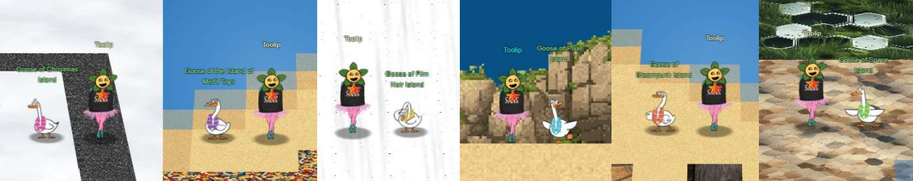
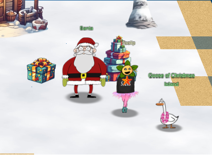

# Welcome

## Introduction

This year, for the first time, I decided to embark on writing a report for the [2023 SANS Holiday Hack Challenge](https://2023.holidayhackchallenge.com/)! Shout out to [Crahan](https://github.com/crahan/HolidayHackChallengeTemplate) for making this awesome and intuitive template available to all.

A trip to the sunny Geese Islands was just the vacation I needed from the cold winter. The itinerary included a cruise around the 6 Geese Islands with shore excursions aplenty. I've created a journal of the challenges I completed that you can check out in the [Objectives](./objectives/o1.md) section. I'm relatively new to the SANS Holiday Hack lore, but I've included some [Easter Eggs](./easter_eggs.md) I've found along the way.

This year included the requirement to a form of AI for at least some of the challenges and Santa gives us a hint with some possibilities.

??? tip "Synthesis is the True Ending"
    *From: Santa* 
    The AI revolution has begun. Some of the most prominent and useful tools born from the advent of powerful AI include ChatGPT, PlayHT, Midjourney, Dall-E 3, Bing AI, and Bard, and Grok.

Throughout this report you will see blocks like the one below that contain my prompts to AI and the responses.

??? example "See AI Assistance"
    **My Prompt:** 
    **ChatGPT Response:**

My Geese Islands itinerary was so jammed packed and I had so much fun I didn't get to see everything, but I'm looking forward to a return trip to catch up on what I've missed and finish this report in the future!

!!! note "100-page submission limit"
    Each year there's a huge number of write-ups that need to be reviewed by the Counter Hack team. To find a good middle ground between preventing information overload and creating a write-up that can stand on its own as a learning resource, some parts, like the *navigation tip* below, are collapsed by default. Skipping over these will not take away from understanding the overall solution, but feel free to expand them to get some additional information.

??? tip "Navigation tip"
    Even with less than 50 pages, there's still quite a bit of information to read through. To make things a little easier, you can use ++"P"++ or ++","++ to go to the previous section, ++"N"++ or ++"."++ to navigate to the next section, and ++"S"++, ++"F"++, or ++"/"++ to open up the search dialog.

    **TL;DR** if you keep pressing ++"N"++ or ++"."++ from this point forward, you'll hit all the content in the right order! :smile:

## Answers

!!! success "1. Holiday Hack Orientation - :fontawesome-solid-star::fontawesome-regular-star::fontawesome-regular-star::fontawesome-regular-star::fontawesome-regular-star:"
    Talk to Jingle Ringford on Christmas Island and [get your bearings at Geese Islands](./objectives/o1.md).

!!! success "2. Snowball Fight - :fontawesome-solid-star::fontawesome-solid-star::fontawesome-regular-star::fontawesome-regular-star::fontawesome-regular-star:"
    Visit Christmas Island and talk to Morcel Nougat about this great new game. [Team up with another player and show Morcel how to win against Santa!](./objectives/o2.md)

!!! success "3. Linux 101 - :fontawesome-solid-star::fontawesome-regular-star::fontawesome-regular-star::fontawesome-regular-star::fontawesome-regular-star:"
    Visit Ginger Breddie in Santa's Shack on Christmas Island to [help him with some basic Linux tasks](./objectives/o3.md). It's in the southwest corner of Frosty's Beach.

!!! success "4. Reportinator - :fontawesome-solid-star::fontawesome-solid-star::fontawesome-regular-star::fontawesome-regular-star::fontawesome-regular-star:"
    Noel Boetie used ChatNPT to write a pentest report. Go to Christmas Island and [help him clean it up](./objectives/o4.md). 
    Finding 1: True 
    Finding 2: True 
    Finding 3: False 
    Finding 4: True 
    Finding 5: True 
    Finding 6: False 
    Finding 7: True 
    Finding 8: True 
    Finding 9: False 

!!! success "5. Azure 101 - :fontawesome-solid-star::fontawesome-solid-star::fontawesome-regular-star::fontawesome-regular-star::fontawesome-regular-star::fontawesome-regular-star:"
    [Help Sparkle Redberry with some Azure command line skills.](./objectives/o5.md) Find the elf and the terminal on Christmas Island.

!!! success "6. Luggage Lock Decode - :fontawesome-solid-star::fontawesome-regular-star::fontawesome-regular-star::fontawesome-regular-star::fontawesome-regular-star::fontawesome-regular-star:"
    Help Garland Candlesticks on the Island of Misfit Toys [get back into his luggage](./objectives/o9.md) by finding the correct position for all four dials

!!! success "7. Linux PrivESC - :fontawesome-solid-star::fontawesome-solid-star::fontawesome-solid-star::fontawesome-regular-star::fontawesome-regular-star::fontawesome-regular-star:"
    [santa](./objectives/o8.md)

!!! success "8. Faster Lock Combination - :fontawesome-solid-star::fontawesome-solid-star::fontawesome-regular-star::fontawesome-regular-star::fontawesome-regular-star::fontawesome-regular-star:"
    Over on Steampunk Island, Bow Ninecandle is having trouble opening a padlock. Do some research and see if you can [help open it](./objectives/o17.md)!

!!! success "9. Game Cartridges: Vol 1 - :fontawesome-solid-star::fontawesome-regular-star::fontawesome-regular-star::fontawesome-regular-star::fontawesome-regular-star::fontawesome-regular-star:"
    [santaconfusedgivingplanetsqrcode](./objectives/o10.md)

!!! failure "10. Game Cartridges - Vol 2 - :fontawesome-solid-star::fontawesome-solid-star::fontawesome-solid-star::fontawesome-regular-star::fontawesome-regular-star::fontawesome-regular-star:"
    Find the second Gamegosling cartridge and beat the game

!!! failure "11. Game Cartridges: Vol 3 - :fontawesome-solid-star::fontawesome-solid-star::fontawesome-solid-star::fontawesome-regular-star::fontawesome-regular-star::fontawesome-regular-star:"
    Find the third Gamegosling cartridge and beat the game

!!! success "12. Na'an - :fontawesome-solid-star::fontawesome-solid-star::fontawesome-regular-star::fontawesome-regular-star::fontawesome-regular-star::fontawesome-regular-star:"
    Shifty McShuffles is hustling cards on Film Noir Island. [Outwit that meddling elf and win!](./objectives/o11.md)

!!! success "13. KQL Kraken Hunt - :fontawesome-solid-star::fontawesome-solid-star::fontawesome-regular-star::fontawesome-regular-star::fontawesome-regular-star::fontawesome-regular-star:"
    [Beware the Cube that Wombles](./objectives/o12.md)

!!! success "14. Phish Detection Agency - :fontawesome-solid-star::fontawesome-solid-star::fontawesome-regular-star::fontawesome-regular-star::fontawesome-regular-star::fontawesome-regular-star:"
    Fitzy Shortstack on Film Noir Island needs help battling dastardly phishers. [Help sort the good from the bad!](./objectives/o13.md)

!!! success "15. Hashcat - :fontawesome-solid-star::fontawesome-solid-star::fontawesome-regular-star::fontawesome-regular-star::fontawesome-regular-star::fontawesome-regular-star:"
    [IluvC4ndyC4nes!](./objectives/o7.md)

!!! success "16. Elf Hunt - :fontawesome-solid-star::fontawesome-solid-star::fontawesome-solid-star::fontawesome-regular-star::fontawesome-regular-star::fontawesome-regular-star:"
    Piney Sappington needs a lesson in JSON web tokens. [Hack Elf Hunt and score 75 points.](./objectives/o14.md)

!!! success "17. Certificate SSHenanigans - :fontawesome-solid-star::fontawesome-solid-star::fontawesome-solid-star::fontawesome-solid-star::fontawesome-solid-star::fontawesome-solid-star:"
    [Gingerbread](./objectives/o15.md)

!!! success "18. The Captain's Comms - :fontawesome-solid-star::fontawesome-solid-star::fontawesome-solid-star::fontawesome-solid-star::fontawesome-solid-star::fontawesome-solid-star:" 
    [Frequency: 10426 - GoDate: 1224 - GoTime: 1200](./objectives/o18.md)

!!! success "19. Active Directory - :fontawesome-solid-star::fontawesome-solid-star::fontawesome-solid-star::fontawesome-solid-star::fontawesome-solid-star::fontawesome-regular-star:"
    [InstructionsForEnteringSatelliteGroundStation.txt](./objectives/o19.md)

!!! success "20. Space Island Door Access Speaker - :fontawesome-solid-star::fontawesome-solid-star::fontawesome-solid-star::fontawesome-regular-star::fontawesome-regular-star::fontawesome-regular-star:"
    There's a [door that needs opening](./objectives/o20.md) on Space Island! Talk to Jewel Loggins there for more information.

!!! failure "21. Camera Access - :fontawesome-solid-star::fontawesome-solid-star::fontawesome-solid-star::fontawesome-regular-star::fontawesome-regular-star::fontawesome-regular-star:"

!!! failure "22. Missile Diversion - :fontawesome-regular-star::fontawesome-regular-star::fontawesome-regular-star::fontawesome-regular-star::fontawesome-regular-star::fontawesome-regular-star:"

## Conclusion

!!! Abstract "Narrative (so far)"
    Just sit right back and you’ll hear a tale, 
    A tale of a yuletide trip 
    That started from a tropic port, 
    Aboard this tiny ship 
    Santa and his helpful elves 
    To Geese Islands did go 
    Continuing their merry work 
    O'er sand instead of snow a
    New this year: a shiny tool 
    The elves logged in with glee 
    What makes short work of many tasks? 
    It's ChatNPT. It's ChatNPT 
    From images to APIs 
    This AI made elves glad 
    But motivations were unknown 
    So was it good or bad? 
    Could it be that NPT 
    Was not from off-the-shelf? 
    Though we'll forgive and trust again 
    We'd found a naughty elf 
    This fancy AI tool of ours 
    With all our work remained 
    Not good or bad, our online friend 
    Just did as it was trained 
    Surely someone's taint must be 
    Upon our AI crutch 
    ...

