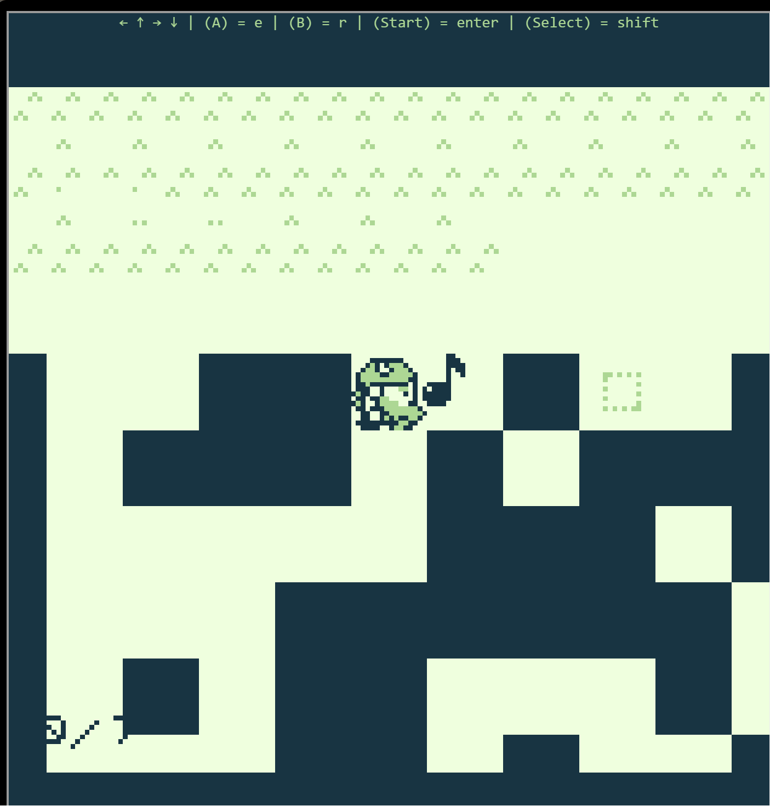

# Game Cartridges: Vol 1

**Difficulty**: :fontawesome-solid-star::fontawesome-regular-star::fontawesome-regular-star::fontawesome-regular-star::fontawesome-regular-star: 
**Direct link**: --

## Objective

!!! question "Request"
    Find the first Gamegosling cartridge and beat the game

??? quote "Dusty Giftwrap"
    Arrr, matey, shiver me timbers! There be buried treasure herrrrre. 
    Just kidding, I'm not really a pirate, I was just hoping it would make finding the treasure easier. 
    I guess you heard about the fabled buried treasure, too? I didn't expect to see anyone else here. This uncharted islet was hard to find.  
    I bet one of these creepy toys has the treasure, and I'm sure not going anywhere near them! 
    If you find the treasure, come back and show me, and I'll tell you what I was able to research about it. 
    Good luck!

## Hints

??? tip "Uncharted"
    *From: Rose Mold* 
    Not all the areas around Geese Islands have been mapped, and may contain wonderous treasures. Go exploring, hunt for treasure, and find the pirate's booty!

??? tip "Gameboy 1"
    *From: Dusty Giftwrap* 
    *Objective: Game Cartridges: Vol 1* 
    1) Giving things a little push never hurts. 2) Out of sight but not out of ear-shot 3) You think you fixed the QR code? Did you scan it and see where it leads?

??? tip "Approximate Proximity"
    *From: Dusty Giftwrap* 
    *Objective: Game Cartridges: Vol 1* 
    Listen for the gameboy cartridge detector's proximity sound that activates when near buried treasure. It may be worth checking around the strange toys in the Tarnished Trove.

## Solution

The first game cartridge can be found at Tarished Trove. Once you obtain the Game Boy Cartridge Detector from XXXX, it can be found in the Items section of your badge. Clicking on `Test Detector` will play the tones that indicate you are near a game cartridge.

Once you locate the game cartridge around the toys at Tarished Trove, it will also appear in your Items.

Clicking on the gray text will open the game. You can start a new game or continue an existing game.

Based on the hints, the game requires fixing a broken QR code and then scanning the code.

??? quote "Game Dialogue"
    Jared: Elf, have you ever heard of a miner named Tom Liston? 
    Elf: What does he mine? 
    Jared: Crypt-o-coin? 
    Elf: *Gasp* The long lost lost treasure of the undead toe? 
    Elf: I can't believe it! 
    Elf: I'd love to quest for the treasure but there ain't no way I'll ever find this Tom Lis... 
    Jared: I'm sending you Tom's first, middle and last name. His homa address. His cell number. And the last four of social. 
    **ELF'S CELL PHONE CHIMES** 
    Elf: Excellent! Never fear Very Senior  Technical Engineer Jared Folkins 
    Elf: I will find this treasure and Liston and I will receive... 
    Jared: *Groans* Ooooh no.... 
    Elf: Muuuch! 
    T-Wiz: I absolutely know what Elf's about to say! 
    Elf: Gloooooory! 

??? quote  "Our Elf hero heads off into the game world..." 
    Ugh! Why in the world does the game world look so disastrously bad?
    *Grumble* When I find the ne'er-do-weller who skimped out on the assets for this game!

??? quote "Elf Meets Dog"
    Kody: *Woof* Hi, I'm Kody! 
    Can you plz fix this QR Code? 
    The developers cheaped out and now a few sing-song blocks are not in the correct position. 
    If you sing to the blocks that are misplaced, they will sing back! 
    Try singing to the block to the south of my position. Hopefully you can fix the misaligned QR blocks. 

Press ++r++ to sing to the block. A movable block will flash green and the correct location will also flash with a green outline. Walking into the block will move it in the direction you are walking.

Theres are 7 blocks that need to be moved into the correct position. Once a block is in the correct place, it will no longer move or sing.

!!! quote
    Kody: Good job! Now go find and fix the rest of the sing-song blocks!

Part of the puzzle is moving the blocks to their positions in the correct order. If you move a block to a dead end or the block is in the way of other blocks, talk to Kody and he will reset the game.

| Block 1                | Block 2                |
| ---------------------- | ---------------------- |
|  |  |

| Block 3                | Block 4                |
| ---------------------- | ---------------------- |
|  |  |

| Block 5                | Block 6                |
| ---------------------- | ---------------------- |
|  |  |

The last block is far from it's correct location so we need to move the block as we sing to it until we find its home.

| Original Location of Block 7 | Moving Block 7   | Final Location of Block 7 |
| ---------------------- | ---------------------- | ---------------------- |
|  |  | |

!!! quote
    Elf: I did it! I fixed the QR code!
    Wait, what's a QR code?

Scanning the QR code takes you to [https://8bitelf.com/](https://8bitelf.com/)
revealing the flag:santaconfusedgivingplanetsqrcode

!!! success "Answer"
    santaconfusedgivingplanetsqrcode

## Response

!!! quote "Dusty Giftwrap"
    Whoa, you found it! 
    It's a... video game cartridge? Coooooollll... I mean, arrrrrr.... 
    So, here's what my research uncovered. Not sure what it all means, maybe you can make sense of it.
