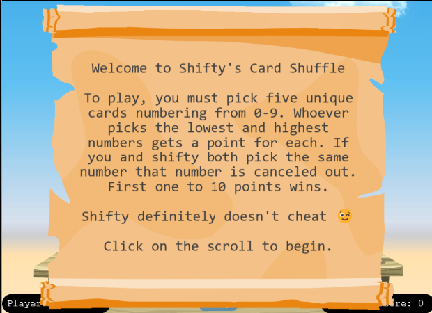
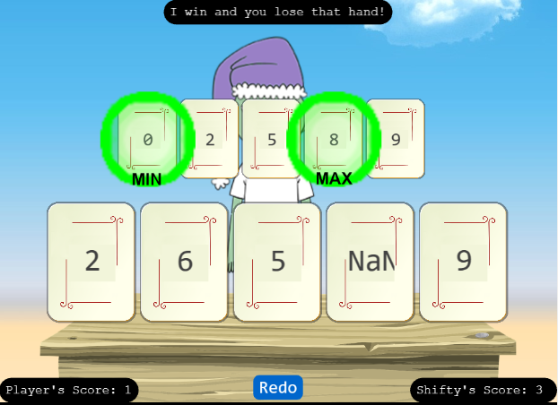
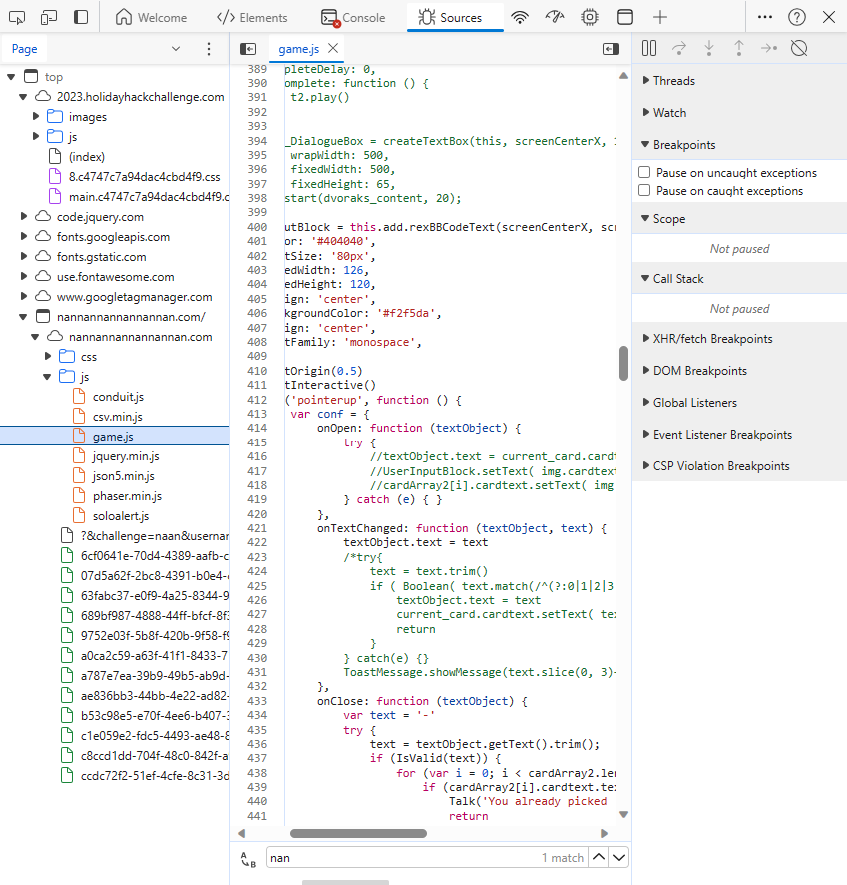
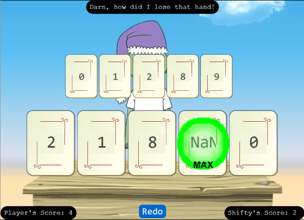
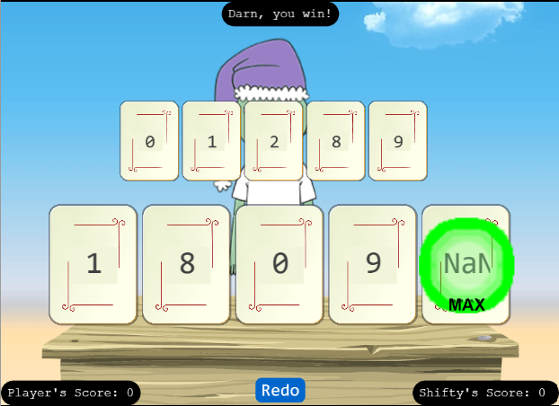

# Na'an

**Difficulty**: :fontawesome-solid-star::fontawesome-solid-star::fontawesome-regular-star::fontawesome-regular-star::fontawesome-regular-star:<br/>
**Direct link**: --

## Objective

!!! question "Request"
    Shifty McShuffles is hustling cards on Film Noir Island. Outwit that meddling elf and win!

??? quote "Shifty McShuffles"
    Hey there, stranger! Fancy a game of cards? Luck's on your side today, I can feel it.<br/>
    Step right up, test your wit! These cards could be your ticket to fortune.<br/>
    Trust me, I've got a good eye for winners, and you've got the look of luck about you.<br/>
    Plus, I'd wager you've never played this game before, as this isn't any ordinary deck of cards. It's made with [Python](https://www.tenable.com/blog/python-nan-injection).<br/>
    The name of the game is to bamboozle the dealer.<br/>
    So whad'ya think? Are you clever enough?<br/>

## Hints

??? tip "Stump the Chump"
    *From: Shifty McShuffles*<br/>
    *Terminal: Na'an*<br/>
    Try to outsmart Shifty by sending him an error he may not understand.

??? tip "The Upper Hand"
    *From: Shifty McShuffles*<br/>
    *Terminal: Na'an*<br/>
    Shifty said his deck of cards is made with Python. Surely there's a [weakness](https://www.tenable.com/blog/python-nan-injection) to give you the upper hand in his game.

## Solution

Something here about the game rules and our objective. The hint "The Upper Hand" tells us that we can perform NaN injection to swing the odds in our favor.



Choosing the numbers 0, 1, 2, 8, 9 always resulted in a tie for me.

We are unable to enter a number outside of 0-9 and entering NaN into the default game does not change the result.



In order to win against our sneaky dealer, we'll need to alter the game. 

If we inspect the page we can find the game.js script



I decided to search for the term NaN to see if there were any other references to it already. And behold, beginning on line 423 we see this comment:
```linenums="423" hl_lines="3"
                        /*try{
                            text = text.trim()
                            if ( Boolean( text.match(/^(?:0|1|2|3|4|5|6|7|8|9|nan)$/ig) ) ) {
                                textObject.text = text
                                current_card.cardtext.setText( textObject.text )
                                return
                            }
                        } catch(e) {}
                        ToastMessage.showMessage(text.slice(0, 3)+' is invalid. Must be 0-9.')*/
```
Let's uncomment this and see what happens. Since NaN is now a valid option for cards, we'll include that as one of the cards each time.



Rinse and repeat to win!



!!! success "Answer"
    Win the game against Shifty McShuffles.

## Response

!!! quote "Shifty McShuffles"
    Well, you sure are more clever than most of the tourists that show up here.<br/>
    I couldn't swindle ya, but don't go telling everyone how you beat me!<br/>
    An elf's gotta put food on the table somehow, and I'm doing the best I can with what I got.<br/>
