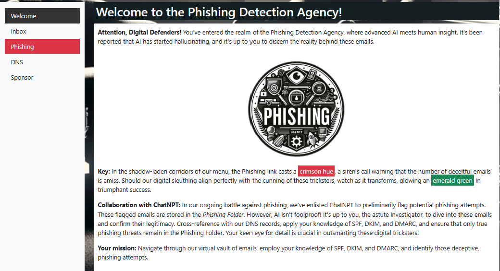
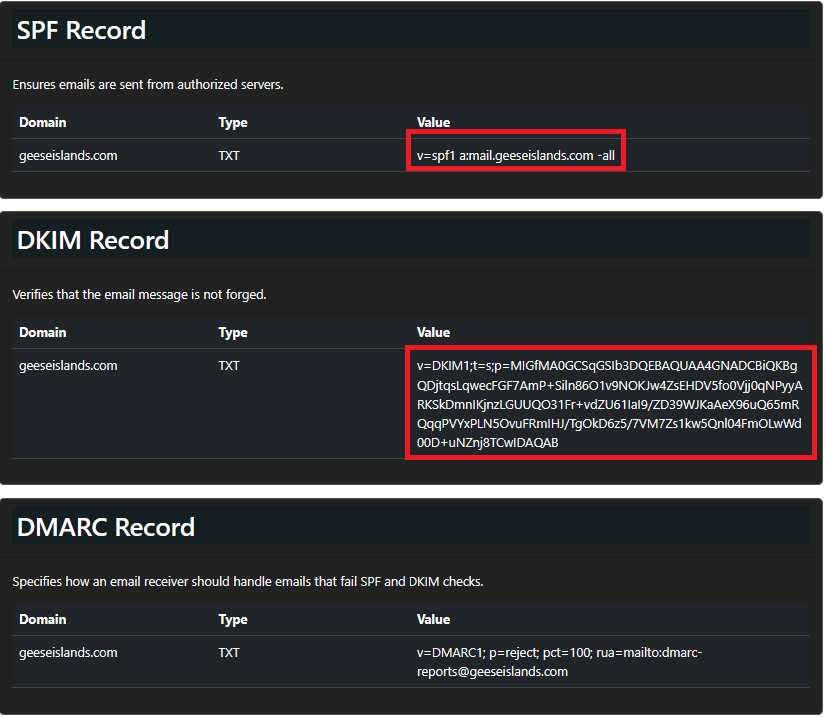
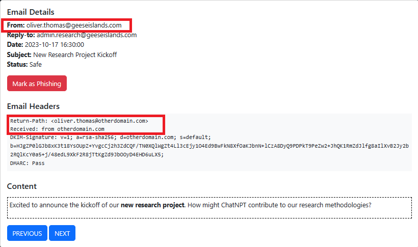
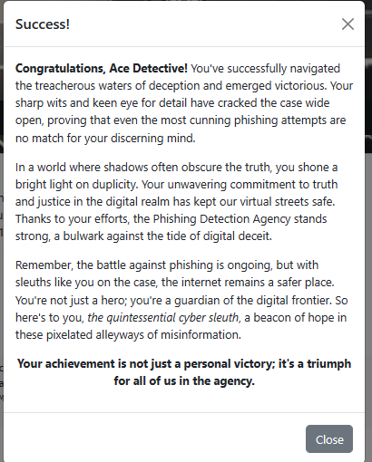

# Phish Detection Agency

**Difficulty**: :fontawesome-solid-star::fontawesome-solid-star::fontawesome-regular-star::fontawesome-regular-star::fontawesome-regular-star: 
**Direct link**: --

## Objective

!!! question "Request"
    Fitzy Shortstack on Film Noir Island needs help battling dastardly phishers. Help sort the good from the bad!

??? quote "Fitzy Shortstack"
    Just my luck, I thought... 
    A cybersecurity incident right in the middle of this stakeout. 
    Seems we have a flood of unusual emails coming in through ChatNPT. 
    Got a nagging suspicion it isn't catching all the fishy ones. 
    You're our phishing specialist right? Could use your expertise in looking through the output of ChatNPT. 
    Not suggesting a full-blown forensic analysis, just mark the ones screaming digital fraud. 
    We're looking at all this raw data, but sometimes, it takes a keen human eye to separate the chaff, doesn't it? 
    I need to get more powdered sugar for my donuts, so do ping me when you have something concrete on this. 

## Hints

??? tip " DMARC, DKIM, and SPF, oh my!"
    *From: Fitzy Shortstack* 
    *Terminal: Phish Detection* 
    Discover the essentials of email security with DMARC, DKIM, and SPF at [Cloudflare's Guide](https://www.cloudflare.com/learning/email-security/dmarc-dkim-spf/).

## Solution
Using our investigative skills and our knowledge of email security that we learned from the [Cloudflare Guide](https://www.cloudflare.com/learning/email-security/dmarc-dkim-spf/) in the hint, we need to review the emails in the Inbox and the Phishing tabs and then choose *Mark as Phishing* or *Mark as Safe*.

It is important to not only look at the Email Header content, but also the Email Details.
After reviewing the DNS tab, we know that a safe email should have an SPF domain of: `geeseislands.com` and a valid and unaltered DKIM signature. We also want to keep in mind that ChatNPT probably marked some DMARC values incorrectly, so we can't only rely on the DMARC *Pass* or *Fail* values.

As we view each email, we see entries like the one below. Even though the DMARC status is *Pass*, the Sender email address is not consistent with the Return-Path in the Email headers. This entry should be marked as *Phishing*.

We continue reviewing all emails until we have correctly categorized all entries. The table below contains the Phishing emails. All other emails in the challenge not listed below are Safe.

| Sender               | Subject               | Status                          |
| :------------------- | :-------------------- | :------------------------------ |
| laura.green@geeseislands.com      | Security Protocol Briefing        | Phishing        |
| michael.roberts@geeseislands.com     | Compliance Training Schedule Announcement | Phishing          |
| nancy@geeseislands.com | Public Relations Strategy Meet | Phishing |
| oliver.thomas@geeseislands.com   | New Research Project Kickoff    | Phishing      |
| quincy.adams@geeseislands.com | Networking Event Success Strategies    | Phishing |
| rachel.brown@geeseislands.com       | Customer Feedback Analysis Meeting    | Phishing     |
| steven.gray@geeseislands.com | Procurement Process Improvements | Phishing |
| ursula.morris@geeseislands.com |  Legal Team Expansion Strategy | Phishing |
| victor.davis@geeseislands.com | Invitation to Research Grant Meeting | Phishing |
| xavier.jones@geeseislands.com | Urgent IT Security Update | Phishing |

!!! success "Answer"
    There are 10 phishing emails.

## Response

!!! quote "Fitzy Shortstack"
    You've cracked the case! Once again, you've proven yourself to be an invaluable asset in our fight against these digital foes.
