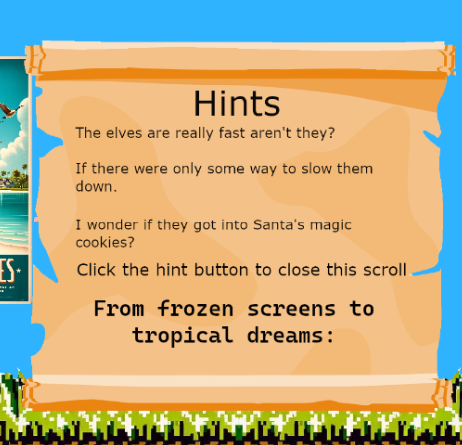
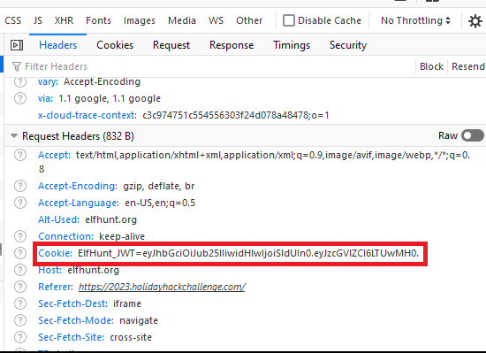
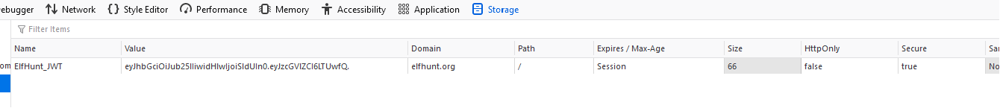
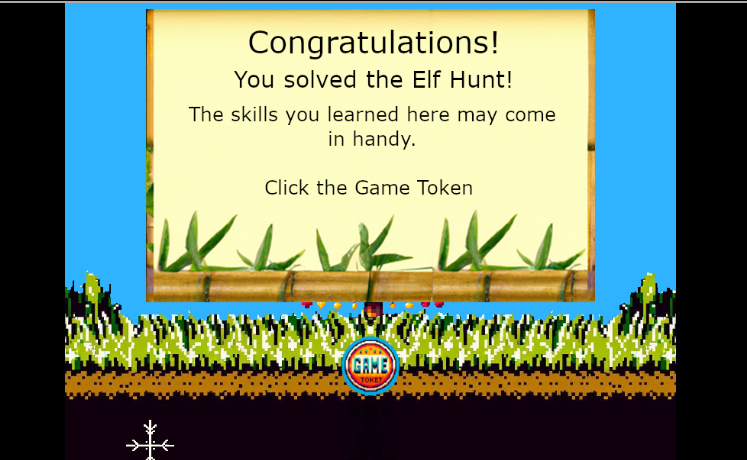

# Elf Hunt

**Difficulty**: :fontawesome-solid-star::fontawesome-solid-star::fontawesome-solid-star::fontawesome-regular-star::fontawesome-regular-star:<br/>
**Direct link**: --

## Objective

!!! question "Request"
    Piney Sappington needs a lesson in JSON web tokens. Hack Elf Hunt and score 75 points.

??? quote "Piney Sappington"
    Hey there, friend! Piney Sappington here.<br/>
    You look like someone who's good with puzzles and games.<br/>
    I could really use your help with this Elf Hunt game I'm stuck on.<br/>
    I think it has something to do with manipulating JWTs, but I'm a bit lost.<br/>
    If you help me out, I might share some juicy secrets I've discovered.<br/>
    Let's just say things around here haven't been exactly... normal.<br/>
    So, what do ya say? Are you in?<br/>
    Oh, brilliant! I just know we'll crack this game together.<br/>
    I can't wait to see what we uncover, and remember, mum's the word!<br/>
    Thanks a bunch! Keep your eyes open and your ears to the ground.<br/>

## Hints

??? tip "JWT Secrets Revealed"
    *From: Piney Sappington*<br/>
    *Terminal: Elf Hunt*<br/>
    Unlock the mysteries of JWTs with insights from [PortSwigger's JWT Guide](https://portswigger.net/web-security/jwt).

## Solution

The hint we received from Piney about JWTs is all we need to solve this challenge This knowledge will also come in handy for [other challenges](./o18.md). Starting the game, we see that these elves are moving very fast and it is difficult to target them. We also see a Hint button in the bottom left:



We need to slow the elves down. Let's inspect the page and see if we see anything that could help us. First thing we find is a script in the iframe element that reveals the speed is related to the JWT: `speed=sessionJWT.speed`. Let's see if we can capture the JWT. I've used Firefox Developer Tools for this challenge.



Perfect. We see the cookie value: `ElfHunt_JWT=eyJhbGciOiJub25lIiwidHlwIjoiSldUIn0.eyJzcGVlZCI6LTUwMH0.` We can easily decode this in [CyberChef](https://cyberchef.org/) or at [jwt.io](https://jwt.io/):

```
{"alg":"none","typ":"JWT"}
{"speed":-500}
```
We've confirmed the JWT controls the speed of the elves and it is currently -500. Let's generate a new JWT with a different speed:
```
{"speed":-50}
Base64 Encoded: eyJzcGVlZCI6LTUwfQ
New JWT:
ElfHunt_JWT=eyJhbGciOiJub25lIiwidHlwIjoiSldUIn0.eyJzcGVlZCI6LTUwfQ.
```
Let's edit the cookie value to be our crafted JWT and restart the game.



Now the elves move *much* slower and we can easily target and hit them until our score reaches 75. 



!!! success "Answer"
    Get a score of 75 to win the game.

## Response

!!! quote "Piney Sappington"
    Well done! You've brilliantly won Elf Hunt! I couldn't be more thrilled. Keep up the fine work, my friend!<br/>
    What have you found there? The Captain's Journal? <br/>
    Yeah, he comes around a lot. You can find his comms office over at Brass Buoy Port on Steampunk Island.
