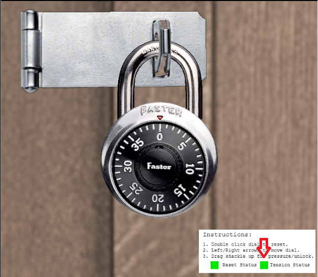
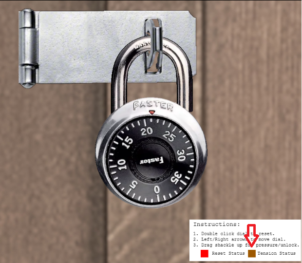
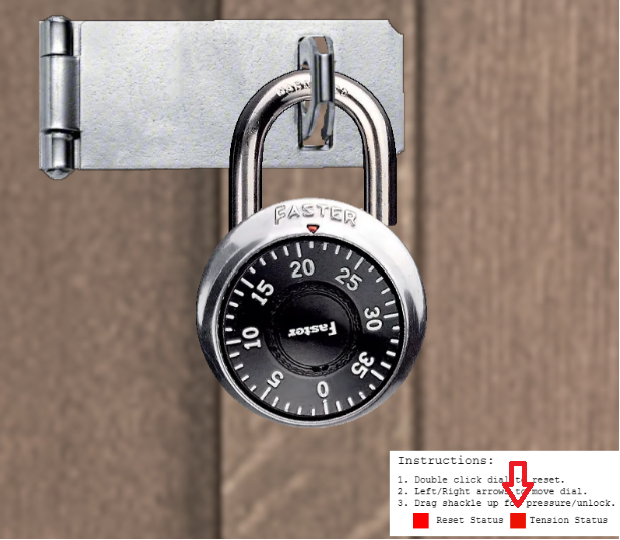

# Faster Lock Combination

**Difficulty**: :fontawesome-solid-star::fontawesome-solid-star::fontawesome-regular-star::fontawesome-regular-star::fontawesome-regular-star: 
**Direct link**: --

## Objective

!!! question "Request"
    Over on Steampunk Island, Bow Ninecandle is having trouble opening a padlock. Do some research and see if you can help open it!

??? quote "Bo Ninecandle"
    Hey there! I'm Bow Ninecandle, and I've got a bit of a... 'pressing' situation. 
    You see, I need to get into the lavatory, but here's the twist: it's secured with a combination padlock. 
    Talk about bad timing, right? I could really use your help to figure this out before things get... well, urgent. 
    I'm sure there are some clever tricks and tips floating around [the web](https://www.youtube.com/watch?v=27rE5ZvWLU0) that can help us crack this code without too much of a flush... I mean fuss. 
    Remember, we're aiming for quick and easy solutions here - nothing too complex. 
    Once we've gathered a few possible combinations, let's team up and try them out. 
    I'm crossing my legs - I mean fingers - hoping we can unlock this door soon. 
    After all, everyone knows that the key to holiday happiness is an accessible lavatory! 
    Let's dive into this challenge and hopefully, we won't have to 'hold it' for too long! Ready to help me out? 

## Solution

The tricky part of this challenge is making sure the Tension status is the correct color for the step you are working on.
Green is no tension, Brown is medium tension, and Red is high tension.

!!! tip 
    If you have trouble with the tension colors being consistent as you work through the steps, switching browsers may help.

| Green | Brown |  Red |
|-------|-------|------|
|  |  |  |

The [video](https://www.youtube.com/watch?v=27rE5ZvWLU0) by the HelpfulLockPicker that Bo Ninecandle mentioned is the only information needed to complete the challenge. I found it easiest to follow along with the video and complete each step as I watched. Each session of the challenge has a different combination, but I'll detail my calculations for the combination I had below:

Sticky number: 17 
Guess numbers: 8, 9

**First Digit:** 
Sticky # (17) + 5 = **22** 

**Third Digit:** 
22/4 = 5 with a remainder 2

Take the two guess numbers and add 10, repeat 3 times:

| Guess # | +10 | +10 | +10 |
|---|---|---|---|
| 8 | 18 | 28 | 38 |
| 9 | 19 | 29 | 39 |

Find the numbers in the above table that when divded by 4 also have a remainder of 2: 
**18** and **38** 

The video states you can look for the number that feels looser when putting heavy tension on the lock and manipulating the dial. Virtually, I had a difficult time deciding which number felt looser so I continued on with the plan to try all 16 combinations instead of trying to narrow it down to 8 combinations.

**Second Digit:** 
Remainder from the previous section (2) + 2 = 4 
remainder (2) + 2 + 4 = 8 

Take those two numbers and add 8, repeat 4 times:

| #| +8 | +8 | +8 | +8 |
|---|---|---|---|---|
| 4 | 12 | 20 | 28 | 36 |
| 8 | 16 | 24 | 32 | 0 |

!!! tip
    The combination can not go over 39 so any number above that starts again at 0 (e.g., 40 = 0, 41 = 1)

The second and third digits must be greater than 2 away from each other so we can disregard any numbers that are 2 digits away from 18 or 38. The possible combinations now look like this:

**Option A:** 
First: 22 
Second: 4, 12, 28, 36, 8, 24, 32, 0 
Third: 18 

OR

**Option B:** 
First: 22 
Second: 4, 12, 20, 28, 8, 16, 24, 32  
Third: 38 

When trying each combination, my challenge completed using this combination: 
**22 - 0 - 18**

!!! success "Answer"
    22 - 0 - 18 (your answer will be different)

## Response

!!! quote "Bo Ninecandle"
    Oh, thank heavens! You're a lifesaver! With your knack for cracking codes, we've just turned a potential 'loo catastrophe' into a holiday triumph!
