# The Captain's Comms

**Difficulty**: :fontawesome-solid-star::fontawesome-solid-star::fontawesome-solid-star::fontawesome-solid-star::fontawesome-solid-star:<br/>
**Direct link**: [Objective 3 terminal](https://.../)

## Objective

!!! question "Request"
    Speak with Chimney Scissorsticks on Steampunk Island about the interesting things the captain is hearing on his new Software Defined Radio. You'll need to assume the GeeseIslandsSuperChiefCommunicationsOfficer role.

??? quote "Chimney Scissorsticks"
    Heya, think you could help Piney Sappington on Rainraster Cliffs on Pixel Island and then give me a hand?<br/><br/>
    Ahoy there, I'm Chimney Scissorsticks!<br/><br/>
    You may have noticed some mischief-makers planning to stir up trouble ashore.<br/>
    They've made many radio broadcasts which the captain has been monitoring with his new software defined radio (SDR).<br/>
    The new SDR uses some fancy JWT technology to control access.<br/>
    The captain has a knack for shortening words, some sorta abbreviation trick.<br/>
    Not familiar with JWT values? No worries; just think of it as a clue-solving game.<br/>
    I've seen that the Captain likes to carry his journal with him wherever he goes.<br/>
    If only I could find the planned "go-date", "go-time", and radio frequency they plan to use.<br/>
    Remember, the captain's abbreviations are your guiding light through this mystery!<br/>
    Once we find a JWT value, these villains won't stand a chance.<br/>
    The closer we are, the sooner we'll be thwarting their pesky plans!<br/>
    We need to recreate an administrative JWT value to successfully transmit a message.<br/>
    Good luck, matey! I've no doubts about your cleverness in cracking this conundrum!<br/>

## Hints

??? tip "Comms Journal"
    *From: Chimney Scissorsticks*<br/>
    *Terminal: The Captain's Comms*<br/>
    I've seen the Captain with [his Journal](https://elfhunt.org/static/images/captainsJournal.png) visiting Pixel Island!

??? tip "Comms JWT Intro"
    *From: Chimney Scissorsticks*<br/>
    *Terminal: The Captain's Comms*<br/>
    A great introduction to JSON Web Tokens is available from [Auth0](https://jwt.io/introduction).

??? tip "Comms Private Key"
    *From: Chimney Scissorsticks*<br/>
    *Terminal: The Captain's Comms*<br/>
    Find a private key, update an existing JWT!

??? tip "Comms Web Interception Proxies"
    *From: Chimney Scissorsticks*<br/>
    *Terminal: The Captain's Comms*<br/>
    Web Interception proxies like Burp and Zap make web sites fun!

??? tip "Comms Abbreviations"
    *From: Chimney Scissorsticks*<br/>
    *Terminal: The Captain's Comms*<br/>
    I hear the Captain likes to abbreviate words in his filenames; shortening some words to just 1,2,3, or 4 letters.

## Solution

Reviewing the hints, journal, and background text, we have a good idea of what we need to do for this challenge. Find the "go-date", "go-time", and "radio frequency" and transmit that information. Since this challenge involves JWTs, we most likely will need to be a different user in order to complete these steps. 

When we enter the Captain's Communcation room, we have a number of items that are interactable. In addition to the many hints we have, words in all capital letters that are sprinkled throughout provide additional clues for navigating through the challenge. 

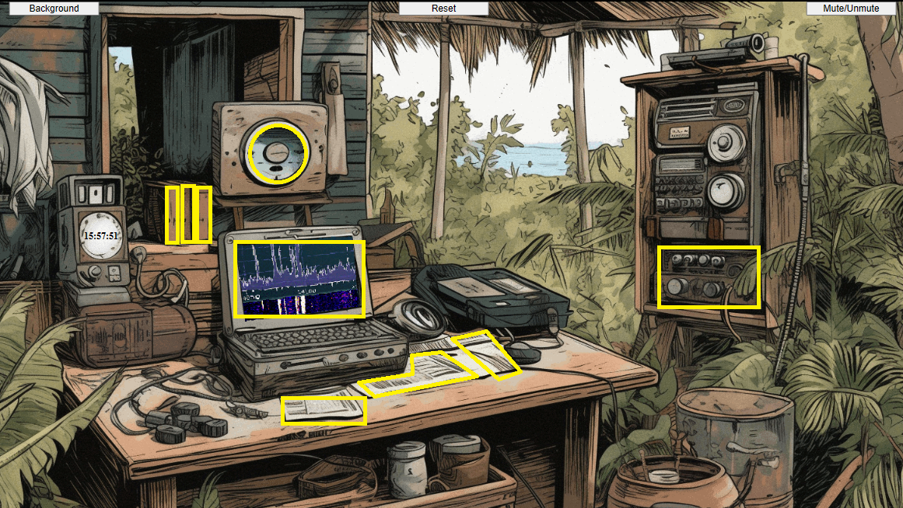

Now we know some important information:<br/>
radioUser: lowest level user<br/>
radioMonitor: can view signals<br/>
radioDecoder: can decode signals<br/>
The radioMonitor token is in `/jwtDefault/rMonitor.tok`.
To use the transmitter we need an admin token for the GeeseIslandsSuperChiefCommunicationsOfficer role. 

When we try to access the SDR, we get an access denied message. Looks like we need to get the radioMonitor role first.

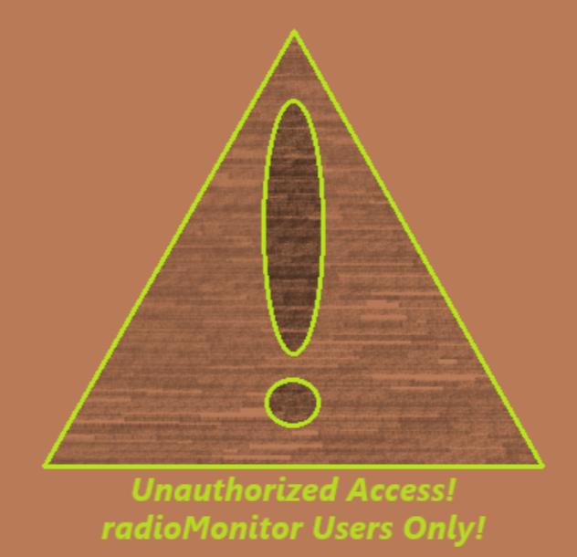

I don't see any terminal to access that would allow us to get access to that `rMonitor.tok` file. Let's take a look at the requests in Burp. Clicking on the SDR again and intercepting the request with Burp, we can see the GET request to `/checkRole` URI and a `justWatchThisRole` cookie. Decoding this JWT shows that we currently have the radioUser role.

```hl_lines="10"
{
  "alg": "RS256",
  "typ": "JWT"
}
{
  "iss": "HHC 2023 Captain's Comms",
  "iat": 1699485795.3403327,
  "exp": 1809937395.3403327,
  "aud": "Holiday Hack 2023",
  "role": "radioUser"
}
```
Since there isn't obvious terminal access, we can make requests to the SDR using Burp.

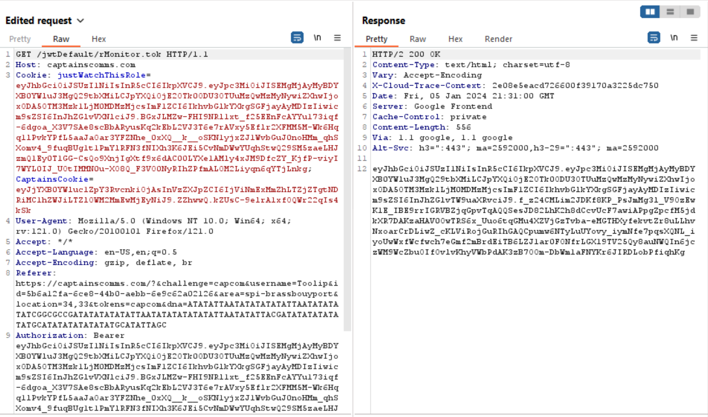

We've received a 200 response with a JWT and it decodes to the radioMonitor role.
```
{
  "iss": "HHC 2023 Captain's Comms",
  "iat": 1699485795.3403327,
  "exp": 1809937395.3403327,
  "aud": "Holiday Hack 2023",
  "role": "radioMonitor"
}
```
Let's try accessing the SDR again with the radioMonitor role token.

!!! tip
    Remember to modify the Cookie *and* the Authorization header in the requests.

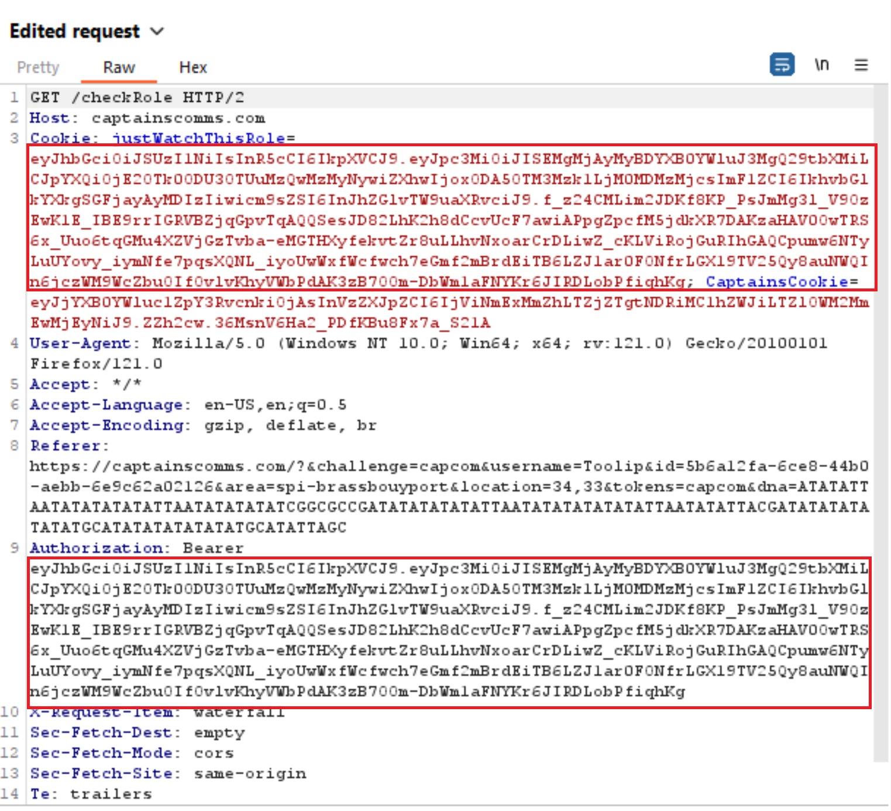

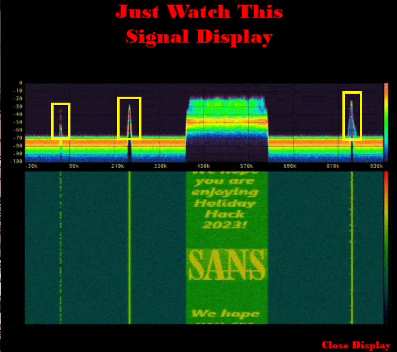

In order to interact with the highlighted signals, we need the radioDecoder role. Since the Captain likes to shorten his filenames, let's match the same format that was used for the `rMonitor.tok` file and see if we can find the radioDecoder token.

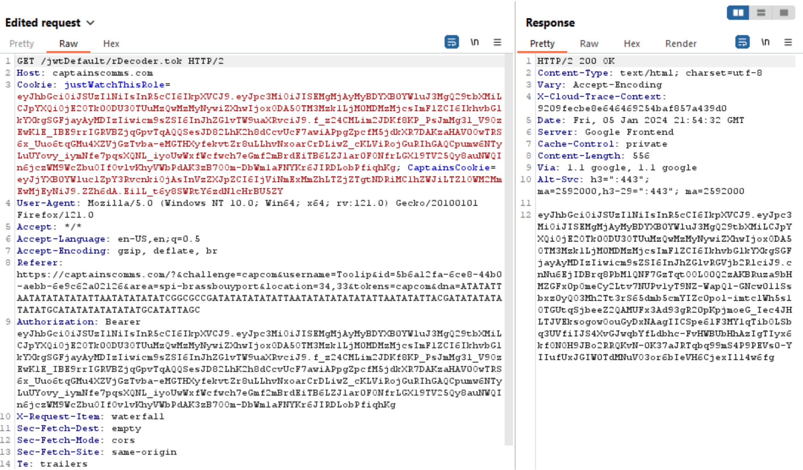

```
{
  "iss": "HHC 2023 Captain's Comms",
  "iat": 1699485795.3403327,
  "exp": 1809937395.3403327,
  "aud": "Holiday Hack 2023",
  "role": "radioDecoder"
}
```
With the radioDecoder token, we can decode the 3 signals for more clues.

**Signal 1**

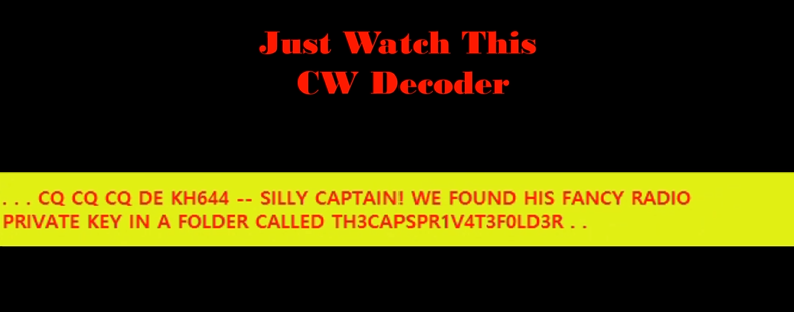

Now we have a folder name for where the private key is stored `TH3CAPSPR1V4T3F0LD3R`.

We also have some interesting radio tidbits that ChatGPT helped me decifer.

??? example "See AI Assistance"
    **My Prompt:**is there any context for this text in a coded message? It originated in a morse code message
    "KH644"<br/>
    **ChatGPT Response:**The text "KH644" doesn't immediately appear to be Morse code, as Morse code typically consists of dots and dashes (periods and hyphens) representing letters and numbers. However, it looks like a combination of letters and numbers. Without more context or information about the encoding method used, it's difficult to decipher its meaning.<br/><br/>
    If it originated from a Morse code message, it's possible that "KH644" was derived from the Morse code and then encoded further using a different system. Without knowing the specific encoding method or having additional information, it's challenging to provide a definitive interpretation.<br/><br/>
    If you have any details about how the Morse code was transformed into "KH644" or if there are any additional clues or context, please provide them. It could be part of a larger puzzle or code that requires a specific key or method to unravel.<br/><br/>
    **My Prompt:**the entire message translated from morse code is: "CQ CQ CQ DE KH644"<br/>
    **ChatGPT Response:**Thank you for providing additional context. The Morse code message "CQ CQ CQ DE KH644" is a common radio communication format. Each element has a specific meaning:<br/>
    "CQ" is a general call inviting any station to respond.<br/>
    "DE" is an abbreviation for "from" in French and is often used in radio communication to indicate the transmitting station.<br/>
    "KH644" is likely a station identifier.<br/>
    So, the entire message "CQ CQ CQ DE KH644" is essentially an invitation for communication, broadcasting from the station with the identifier "KH644." This kind of format is commonly used in amateur radio and other radio communication scenarios to initiate contact and establish communication with other stations. If you have more specific questions or if there's anything else you'd like to know about this message, feel free to ask!<br/>

**Signal 2**

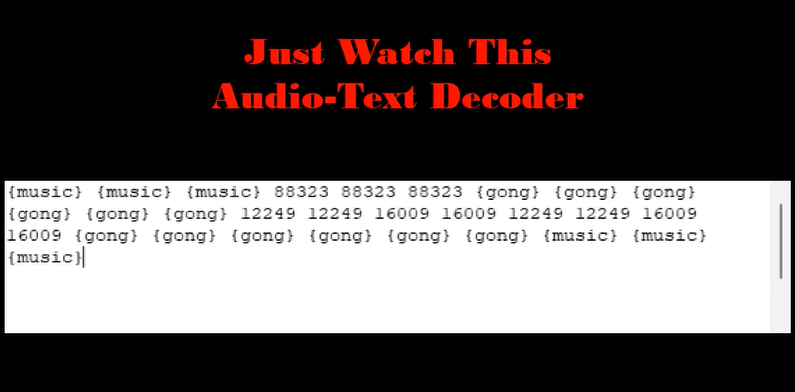

This message is confusing unless we have read the Just Watch This Appendix A - Decoder Index entry about the Lincolnshire Poacher. Even after reading more about number stations, the meaning of this message alluded me. After reviewing what information I was missing for the objective, I still needed the go-date and go-time. I asked ChatGPT for assistance.

??? example "See AI Assistance"
    **My Prompt:**what does this coded message mean?
    {music} {music} {music} 88323 88323 88323 {gong} {gong} {gong} {gong} {gong} {gong} 12249 12249 16009 16009 12249 12249 16009 16009 {gong} {gong} {gong} {gong} {gong} {gong} {music} {music} {music}<br/>
    **ChatGPT Response:**The coded message you provided appears to be a sequence of symbols, including "{music}" and "{gong}" along with numerical values. Without additional context or a specific code key, it's challenging to decipher the exact meaning of the message.<br/>
    If this is part of a puzzle or a specific code system, you might need more information or instructions to interpret it correctly. Alternatively, if it's a personal code or a creative expression, it could have a unique meaning known only to the creator. If you have any additional details or context, please provide them, and I'll do my best to help you understand the message.<br/><br/>
    **My Prompt:**this message is related to number stations like the Lincolnshire Poacher - does that provided the needed context?<br/>
    **ChatGPT Response:**Ah, I see. Number stations are mysterious shortwave radio stations that transmit seemingly random sequences of numbers or letters. The Lincolnshire Poacher is one such infamous number station that used a melody resembling the English folk song "The Lincolnshire Poacher" as an identifier.<br/>
    Given this context, your coded message seems to follow a similar pattern, with placeholders like "{music}" and "{gong}" possibly representing specific sounds or signals, and the numerical values interspersed between them. The numbers might be part of a code or cipher, similar to how numbers in number stations are used to convey messages.<br/>
    Unfortunately, without a specific key or information on how to decode the message, it's challenging to provide a precise interpretation. If you have additional details or a decoding key, I could attempt to help further. Otherwise, it might remain a mystery or a creative expression inspired by number stations.<br/>
    **My Prompt:**does this message mean anything in the context of a coded date or time? 12249 12249 16009 16009 12249 12249 16009 16009<br/>
    **ChatGPT's Response:**The sequence of numbers you provided, "12249 12249 16009 16009 12249 12249 16009 16009," doesn't immediately resemble a standard representation of a date or time. In many coding systems or ciphers, numbers might be used to represent letters or have specific meanings, but without additional information about the encoding method, it's challenging to decipher.<br/>
    If this sequence is part of a coded message related to a date or time, it could be encoded in a specific way unique to the context or system used. For example, in some cases, numbers might represent letters using a simple substitution cipher, or they might be part of a more complex cryptographic scheme.<br/>
    If you have any additional information about the encoding method, key, or context surrounding the message, please provide it, and I'll do my best to help you interpret it. Otherwise, decoding this sequence without more information could be challenging.<br/>

I did some more reading about number station messages and they often required a one-time pad to decode them. I looked through the available information and didn't find one, but after staring at the message section for way too long, I did see a possible data and time. By removing the trailing '9' from each group of numbers, we have 1224 and 1600. In keeping with the holiday theme, 1224 could be a date of Christmas Eve and 1600 could be a time since the clock in the Comms room is set to a 24 hour clock.

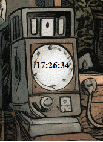

**Signal 3**

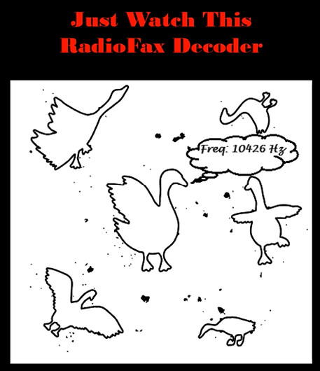

This signal was easy in comparison to decifer - a map of the Geese Islands with the radio frequency - 10426 Hz.

**Transmitter Access**

Now that we have the information for the transmission, we need access to the transmitter. We need to generate a token for the `GeeseIslandsSuperChiefCommunicationsOfficer` role. The public key location is noted in the Captain's Initial To-Do list: `/jwtDefault/keys/capsPubKey.key`. 

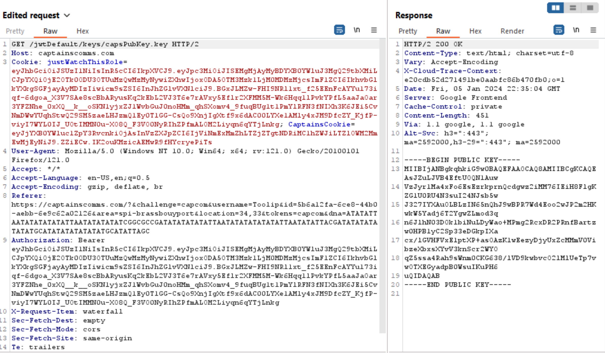

We can also piece together the private key location. 
The private key is in a "folder I hope no one will find." This folder name was revealed in the Signal 1 message.
Since the private key is, well, a key... that folder could be in the /jwtDefault/keys/ directory.
Based on the Captain's way of named files, we can guess the name of the private key file.
`/jwtDefault/keys/TH3CAPSPR1V4T3F0LD3R/capsPrivKey.key`

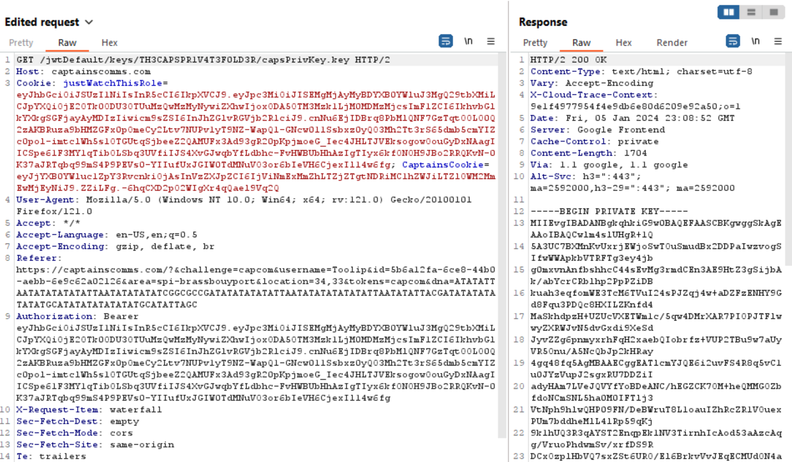

Success! Now we can generate a token for the GeeseIslandsSuperChiefCommunicationsOfficer role. I used [https://jwt.io/](https://jwt.io/).

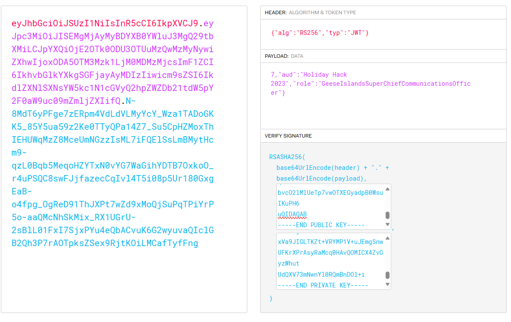

With this token we can access the transmitter and send the message.
!!! tip 
    Remember to double check the obective requirement details in the background section.

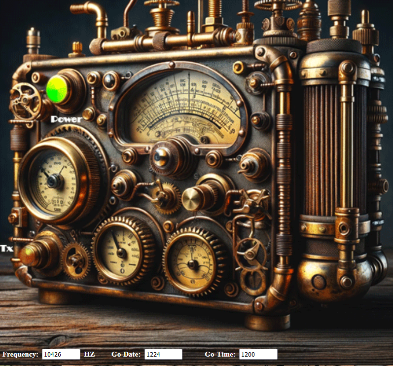

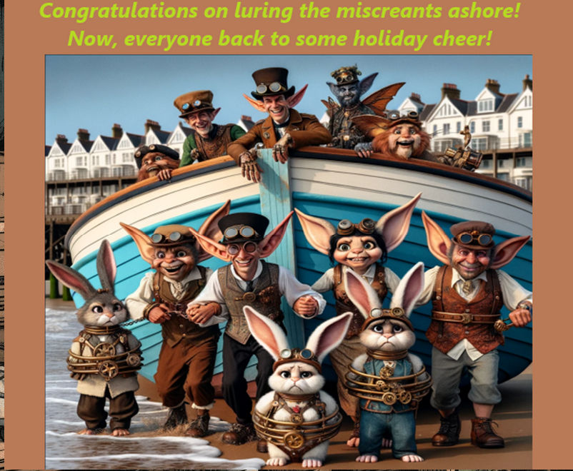

!!! success "Answer"
    Frequency: 10426<br/>
    GoDate: 1224<br/> 
    GoTime: 1200

## Response

!!! quote "Chimney Scissorsticks"
    Brilliant work! You've outsmarted those scoundrels with finesse!
