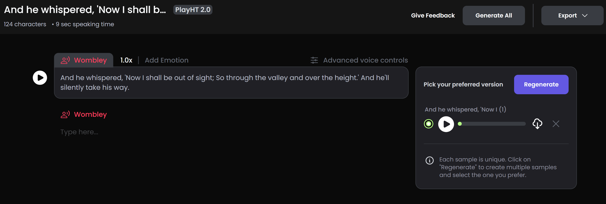
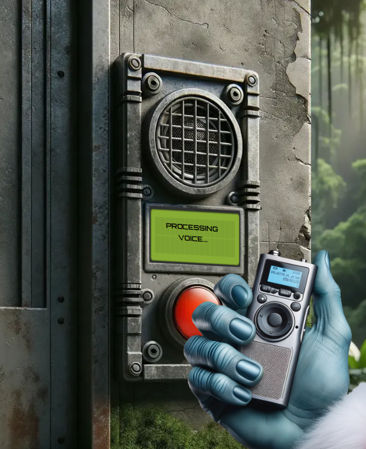
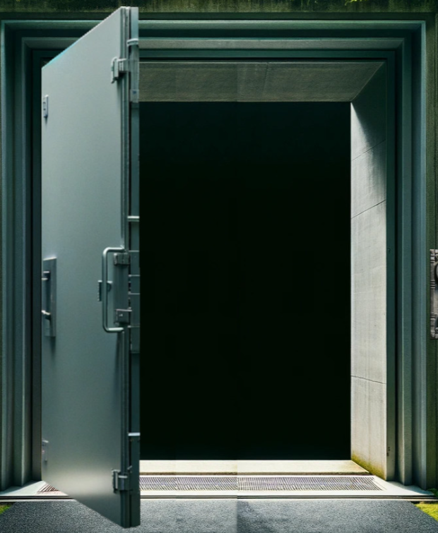

# Space Island Door Access Speaker

**Difficulty**: :fontawesome-solid-star::fontawesome-solid-star::fontawesome-solid-star::fontawesome-regular-star::fontawesome-regular-star: 
**Direct link**: --

## Objective

!!! question "Request"
    There's a door that needs opening on Space Island! Talk to Jewel Loggins there for more information.

??? quote "Jewel Loggins"
    What are you doing here, and who are you? 
    Me first? I'm Jewel Loggins. And I was trekking through the jungle and happened to find this place. 
    I liked this spot and decided to set up camp. Seeing you here is quite the surprise. 
    Well, because the only other person I've ever seen come here is Wombley Cube. 
    I thought this tram station in the middle of the jungle was strange to begin with, but then Wombley added to the intrigue. 
    I guess all this spy stuff is typical for him, so maybe I shouldn't think much of it. I'm sure everything's fine. 
    Every time he comes here, he says something to the speaker. Then, the door opens, and he rides the tram somewhere. 
    I gave it a try, but the door didn't open for me. Knowing Wombley, it's some kind of secret passphrase. 
    If you wanna see where the tram goes, I think you need to find out what that passphrase is. 
    Ribb Bonbowford over at Coggoggle Marina on Steampunk Island works with Wombley. Try asking if he knows. 
    I hope you find it. I'll be here when you get back!  
    What, you know the passphrase!? Let me try it! 
    Nope, didn't work. Knowing Wombley, the passphrase isn't the only requirement. He's all about that MFA! 
    Oh yeah, multi-factor authentication! The passphrase for something he knows, and his voice for something he is! 
    That's it! You need to be Wombley. You need his voice. Now, how are you gonna get that? 
    Since only us elves can get a subscription to use ChatNPT, try searching for another AI tool that can simulate voices. I'm sure there's one out there. 

## Hints

??? tip "MFA: Something You Are"
    *From: Jewel Loggins* 
    *Terminal: Space Island Access Speaker* 
    It seems the Access Speaker is programmed to only accept Wombley's voice. Maybe you could get a sample of his voice and use an AI tool to simulate Wombley speaking the passphrase.

??? tip "MFA: Something You Know"
    *From: Jewel Loggins* 
    *Terminal: Space Island Access Speaker* 
    Wombley says a specific phrase into the Access Speaker. He works in the Research Department and everything they do it super secret, so it may be a challenge to find out what the phrase is. Ribb also works in that department. Try to find and ask him.

## Solution

In the Active Directory challenge we discovered the passphrase needed to enter the Satellite Ground Station.
!!! quote "InstructionsForEnteringSatelliteGroundStation.txt "
    To enter the Satellite Ground Station (SGS), say the following into the speaker: 
    And he whispered, 'Now I shall be out of sight; 
    So through the valley and over the height.' 
    And he'll silently take his way.

We also know that just the passphrase won't work, we also need to use Wombley's voice. Luckily, we have a copy of his [audiobook](https://www.holidayhackchallenge.com/2023/wombleycube_the_enchanted_voyage.mp3.zip).

!!! example "AI Assistance"
    [PlayHT](https://play.ht/) is a voice cloning AI service that allows us to mimic Wombley's voice reading the passphrase.

PlayHT operates as a freemium model, so we can create a free account and create a WAV file of the passphrase using Wombley's voice.

When we click on the speaker, we can play the generated WAV file and the door opens.

!!! success "Answer"
    Door at Spaceport Point opens.

## Response

!!! quote "Jewel Loggins"
    Are you like a master spy or something? I've only seen stuff like that in the movies! 
    It sure is scary what you can do with AI, huh? I sure hope ChatNPT has better guardrails in place.
