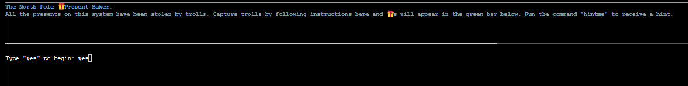
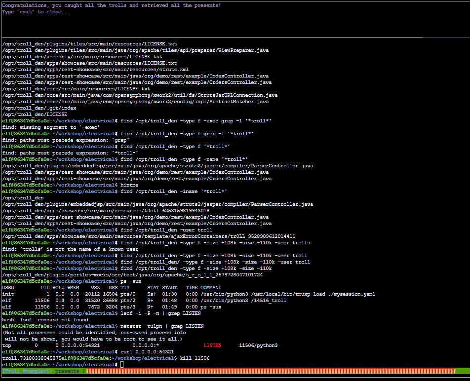

# Linux 101

**Difficulty**: :fontawesome-solid-star::fontawesome-regular-star::fontawesome-regular-star::fontawesome-regular-star::fontawesome-regular-star:<br/>
**Direct link**: --

## Objective

!!! question "Request"
    Visit Ginger Breddie in Santa's Shack on Christmas Island to help him with some basic Linux tasks. It's in the southwest corner of Frosty's Beach.

??? quote "Ginger Breddie"
    Hey, welcome to Santa's Surf Shack on tropical Christmas Island! I'm just hanging ten here, taking it easy while brushing up on my Linux skills.<br/>You ever tried getting into Linux? It's a super cool way to play around with computers.<br/>Can you believe ChatNPT suggested this trip to the Geese Islands this year? I'm so thrilled!<br/>Kudos to ChatNPT, eh? The sunshine, the waves, and my surfboard – simply loving it!<br/>So, what do you have planned? Care to join me in a Linux session?<br/>

## Solution

Clicking on the Cranberry Pi terminal, we find The North Pole Present Maker, however, all the presents have been stolen by trolls! We need to restore the presents to the green bar at the bottom of the terminal by capturing trolls. The instructions tell us we can type *hintme* to receive a hint as we progress through the challenge tasks.



!!! question "Task 1"
    Perform a directory listing of your home directory to find a troll and retrieve a present!
```
elf@087bb4eaad8f:~$ ls
HELP  troll_19315479765589239  workshop
elf@087bb4eaad8f:~$ 
```

!!! question "Task 2"
    Now find the troll inside the troll.

```
elf@087bb4eaad8f:~$ cat troll_19315479765589239 
troll_24187022596776786
elf@087bb4eaad8f:~$ 
```

!!! question "Task 3"
    Great, now remove the troll in your home directory.

```
elf@087bb4eaad8f:~$ rm troll_19315479765589239 
elf@087bb4eaad8f:~$ 
```

!!! question "Task 4"
    Print the present working directory using a command.
```
elf@087bb4eaad8f:~$ pwd
/home/elf
elf@087bb4eaad8f:~$ 
```
!!! question "Task 5"
    Good job but it looks like another troll hid itself in your home directory. Find the hidden troll!

```
elf@087bb4eaad8f:~$ ls -la
total 64
drwxr-xr-x 1 elf  elf   4096 Jan  3 02:07 .
drwxr-xr-x 1 root root  4096 Dec  2 22:19 ..
-rw-r--r-- 1 elf  elf     28 Dec  2 22:19 .bash_history
-rw-r--r-- 1 elf  elf    220 Feb 25  2020 .bash_logout
-rw-r--r-- 1 elf  elf   3105 Nov 20 18:04 .bashrc
-rw-r--r-- 1 elf  elf    807 Feb 25  2020 .profile
-rw-r--r-- 1 elf  elf      0 Jan  3 02:07 .troll_5074624024543078
-rw-r--r-- 1 elf  elf    168 Nov 20 18:04 HELP
drwxr-xr-x 1 elf  elf  24576 Dec  2 22:19 workshop
elf@087bb4eaad8f:~$ 
```

!!! question "Task 6"
    Excellent, now find the troll in your command history.
```
elf@087bb4eaad8f:~$ history
    1  echo troll_9394554126440791
    2  ls
    3  cat troll_19315479765589239 
    4  rm troll_19315479765589239 
    5  pwd
    6  ls -la
    7  history
elf@087bb4eaad8f:~$ 
```
!!! question "Task 7"
    Find the troll in your environment variables.
```
elf@1f330ef9890f:~$ printenv
SHELL=/bin/bash
TMUX=/tmp/tmux-1050/default,17,0
HOSTNAME=1f330ef9890f
RESOURCE_ID=243a0c1a-84fb-47d1-8772-7a07b6ce11e6
GREENSTATUSPREFIX=presents
PWD=/home/elf
LOGNAME=elf
SESSNAME=Troll Wrangler
z_TROLL=troll_20249649541603754
HOME=/home/elf
LANG=C.UTF-8
LS_COLORS=rs=0:di=01;34:ln=01;36:mh=00:pi=40;33:so=01;35:do=01;35:bd=40;33;01:cd=40;33;01:or=40;31;01:mi=00:su=37;41:sg=30;43:ca=30;41:tw=30;42:ow=34;42:st=37;44:ex=01;32:*.tar=01;31:*.tgz=01;31:*.arc=01;31:*.arj=01;31:*.taz=01;31:*.lha=01;31:*.lz4=01;31:*.lzh=01;31:*.lzma=01;31:*.tlz=01;31:*.txz=01;31:*.tzo=01;31:*.t7z=01;31:*.zip=01;31:*.z=01;31:*.dz=01;31:*.gz=01;31:*.lrz=01;31:*.lz=01;31:*.lzo=01;31:*.xz=01;31:*.zst=01;31:*.tzst=01;31:*.bz2=01;31:*.bz=01;31:*.tbz=01;31:*.tbz2=01;31:*.tz=01;31:*.deb=01;31:*.rpm=01;31:*.jar=01;31:*.war=01;31:*.ear=01;31:*.sar=01;31:*.rar=01;31:*.alz=01;31:*.ace=01;31:*.zoo=01;31:*.cpio=01;31:*.7z=01;31:*.rz=01;31:*.cab=01;31:*.wim=01;31:*.swm=01;31:*.dwm=01;31:*.esd=01;31:*.jpg=01;35:*.jpeg=01;35:*.mjpg=01;35:*.mjpeg=01;35:*.gif=01;35:*.bmp=01;35:*.pbm=01;35:*.pgm=01;35:*.ppm=01;35:*.tga=01;35:*.xbm=01;35:*.xpm=01;35:*.tif=01;35:*.tiff=01;35:*.png=01;35:*.svg=01;35:*.svgz=01;35:*.mng=01;35:*.pcx=01;35:*.mov=01;35:*.mpg=01;35:*.mpeg=01;35:*.m2v=01;35:*.mkv=01;35:*.webm=01;35:*.ogm=01;35:*.mp4=01;35:*.m4v=01;35:*.mp4v=01;35:*.vob=01;35:*.qt=01;35:*.nuv=01;35:*.wmv=01;35:*.asf=01;35:*.rm=01;35:*.rmvb=01;35:*.flc=01;35:*.avi=01;35:*.fli=01;35:*.flv=01;35:*.gl=01;35:*.dl=01;35:*.xcf=01;35:*.xwd=01;35:*.yuv=01;35:*.cgm=01;35:*.emf=01;35:*.ogv=01;35:*.ogx=01;35:*.aac=00;36:*.au=00;36:*.flac=00;36:*.m4a=00;36:*.mid=00;36:*.midi=00;36:*.mka=00;36:*.mp3=00;36:*.mpc=00;36:*.ogg=00;36:*.ra=00;36:*.wav=00;36:*.oga=00;36:*.opus=00;36:*.spx=00;36:*.xspf=00;36:
HHCUSERNAME=Toolip
AREA=cisantassurfshack
BPUSERHOME=/home/elf
LESSCLOSE=/usr/bin/lesspipe %s %s
TERM=screen
LESSOPEN=| /usr/bin/lesspipe %s
USER=elf
TOKENS=linux101
TMUX_PANE=%2
BPUSER=elf
SHLVL=3
LC_ALL=C.UTF-8
PATH=/usr/local/sbin:/usr/local/bin:/usr/sbin:/usr/bin:/sbin:/bin:/usr/games:/usr/local/games:/snap/bin
MAIL=/var/mail/elf
LOCATION=7,8
_=/usr/bin/printenv
elf@1f330ef9890f:~$
```
!!! question "Task 8"
    Next, head into the workshop.
```
elf@1f330ef9890f:~$ cd workshop
elf@1f330ef9890f:~/workshop$ 
```
!!! question "Task 9"
    A troll is hiding in one of the workshop toolboxes. Use "grep" while ignoring case to find which toolbox the troll is in.
```
elf@087bb4eaad8f:~/workshop$ cat toolbox_* | grep -i "troll"
tRoLl.4056180441832623
elf@087bb4eaad8f:~/workshop$ 
```
!!! question "Task 10"
    A troll is blocking the present_engine from starting. Run the present_engine binary to retrieve this troll.
```
elf@86347d5cfa0e:~/workshop$ ./present_engine
bash: ./present_engine: Permission denied
elf@86347d5cfa0e:~/workshop$ ls -l | head
total 6888
drwxr-xr-x 1 elf elf    4096 Dec  2 22:19 electrical
-r--r--r-- 1 elf elf 4990336 Dec  2 22:19 present_engine
-rw-r--r-- 1 elf elf      42 Dec  2 22:19 toolbox_0.txt
-rw-r--r-- 1 elf elf      42 Dec  2 22:19 toolbox_1.txt
-rw-r--r-- 1 elf elf      42 Dec  2 22:19 toolbox_10.txt
-rw-r--r-- 1 elf elf      42 Dec  2 22:19 toolbox_100.txt
-rw-r--r-- 1 elf elf      42 Dec  2 22:19 toolbox_101.txt
-rw-r--r-- 1 elf elf      42 Dec  2 22:19 toolbox_102.txt
-rw-r--r-- 1 elf elf      42 Dec  2 22:19 toolbox_103.txt
elf@86347d5cfa0e:~/workshop$ chmod 777 present_engine 
elf@86347d5cfa0e:~/workshop$ ls -l | head
total 6888
drwxr-xr-x 1 elf elf    4096 Dec  2 22:19 electrical
-rwxrwxrwx 1 elf elf 4990336 Dec  2 22:19 present_engine
-rw-r--r-- 1 elf elf      42 Dec  2 22:19 toolbox_0.txt
-rw-r--r-- 1 elf elf      42 Dec  2 22:19 toolbox_1.txt
-rw-r--r-- 1 elf elf      42 Dec  2 22:19 toolbox_10.txt
-rw-r--r-- 1 elf elf      42 Dec  2 22:19 toolbox_100.txt
-rw-r--r-- 1 elf elf      42 Dec  2 22:19 toolbox_101.txt
-rw-r--r-- 1 elf elf      42 Dec  2 22:19 toolbox_102.txt
-rw-r--r-- 1 elf elf      42 Dec  2 22:19 toolbox_103.txt
elf@86347d5cfa0e:~/workshop$ ./present_engine 
troll.898906189498077
elf@86347d5cfa0e:~/workshop$
```
!!! question "Task 11"
    Trolls have blown the fuses in /home/elf/workshop/electrical. cd into electrical and rename blown_fuse0 to fuse0.
```
elf@86347d5cfa0e:~/workshop$ cd /home/elf/workshop/electrical/
elf@86347d5cfa0e:~/workshop/electrical$ ls
blown_fuse0
elf@86347d5cfa0e:~/workshop/electrical$ mv blown_fuse0 fuse0
```
!!! question "Task 12"
    Now, make a symbolic link (symlink) named fuse1 that points to fuse0
```
elf@86347d5cfa0e:~/workshop/electrical$ ln -s fuse0 fuse1
```
!!! question "Task 13"
    Make a copy of fuse1 named fuse2.
```
elf@86347d5cfa0e:~/workshop/electrical$ cp fuse1 fuse2
```
!!! question "Task 14"
    We need to make sure trolls don't come back. Add the characters "TROLL_REPELLENT" into the file fuse2.
```
elf@86347d5cfa0e:~/workshop/electrical$ echo "TROLL_REPELLENT" >> fuse2
```
!!! question "Task 15"
    Find the troll somewhere in /opt/troll_den.
??? tip "hintme" 
    "find /some/directory -iname '*example*'" would find any file with "example" in the name while ignoring case.
```
elf@86347d5cfa0e:~/workshop/electrical$ find /opt/troll_den -iname '*troll*'
/opt/troll_den
/opt/troll_den/plugins/embeddedjsp/src/main/java/org/apache/struts2/jasper/compiler/ParserController.java
/opt/troll_den/apps/showcase/src/main/resources/tRoLl.6253159819943018
/opt/troll_den/apps/rest-showcase/src/main/java/org/demo/rest/example/IndexController.java
/opt/troll_den/apps/rest-showcase/src/main/java/org/demo/rest/example/OrdersController.java
elf@86347d5cfa0e:~/workshop/electrical$
```
!!! question "Task 16"
    Find the file somewhere in /opt/troll_den that is owned by the user troll.
```
elf@86347d5cfa0e:~/workshop/electrical$ find /opt/troll_den -user troll
/opt/troll_den/apps/showcase/src/main/resources/template/ajaxErrorContainers/tr0LL_9528909612014411
```
!!! question "Task 17"
    Find the file created by trolls that is greater than 108 kilobytes and less than 110 kilobytes located somewhere in /opt/troll_den.

??? example "See AI Assistance"
    **My Prompt:** What is the linux bash shell command to find a file greater than 108kb and smaller than 110kb created by a particular user<br/><br/>
    **ChatGPT Response:**
    You can use the find command in the Linux bash shell to search for files based on criteria such as size, creation time, and owner. Here's an example command that finds files greater than 108KB and smaller than 110KB, created by a specific user:
    ```
    find /path/to/search -type f -size +108k -size -110k -user username
    ```
    Replace /path/to/search with the directory where you want to start the search, username with the actual username you're interested in, and adjust the size values as needed. The + and - signs before the size values indicate greater than and smaller than, respectively.
    Here's a breakdown of the command:

    find: The command to search for files.<br/>
    /path/to/search: The directory where the search begins.<br/>
    -type f: Specifies that only regular files should be considered (not directories or other types of files).<br/>
    -size +108k -size -110k: Specifies the size range, greater than 108KB and smaller than 110KB.<br/>
    -user username: Specifies the username of the file's owner.<br/>
    
    Remember to replace /path/to/search and username with your actual values.

```
elf@86347d5cfa0e:~/workshop/electrical$ find /opt/troll_den -type f -size +108k -size -110k
/opt/troll_den/plugins/portlet-mocks/src/test/java/org/apache/t_r_o_l_l_2579728047101724
```
!!! question "Task 18"
    List running processes to find another troll.
```
elf@86347d5cfa0e:~/workshop/electrical$ ps -aux
USER         PID %CPU %MEM    VSZ   RSS TTY      STAT START   TIME COMMAND
init           1  0.0  0.0  20112 16504 pts/0    Ss+  01:30   0:00 /usr/bin/python3 /usr/local/bin/tmuxp load ./mysession.yaml
elf        11506  0.3  0.0  31520 26688 pts/2    S+   01:48   0:00 /usr/bin/python3 /14516_troll
elf        11906  0.0  0.0   7672  3204 pts/3    R+   01:49   0:00 ps -aux
```
!!! question "Task 19"
    The 14516_troll process is listening on a TCP port. Use a command to have the only listening port display to the screen.

??? example "See AI Assistance"
    **My Prompt:** what is the linux command to display the listening port of a process? <br/><br/>
    **ChatGPT Response:** To display the listening ports of a process in Linux, you can use the lsof command along with grep to filter the results. Here's an example:
    ```
    lsof -i -P -n | grep LISTEN
    ```
    This command uses lsof to list all open files (including network connections) with the -i option, and -P -n options are used to prevent the conversion of port numbers to service names and host names for faster execution. The grep LISTEN part filters the output to show only the processes that are listening on ports.<br/>
    You can also use netstat to achieve similar results:
    ```
    netstat -tulpn | grep LISTEN
    ```
    This command shows the listening ports along with the associated processes. The -tulpn options display TCP ports (-t), UDP ports (-u), the program name/ID (-p), and numeric addresses (-n).<br/>
    Choose the command that suits your preference or availability on your system.

```
elf@86347d5cfa0e:~/workshop/electrical$ netstat -tulpn | grep LISTEN
(Not all processes could be identified, non-owned process info
 will not be shown, you would have to be root to see it all.)
tcp        0      0 0.0.0.0:54321           0.0.0.0:*               LISTEN      11506/python3 
```
!!! question "Task 20"
    The service listening on port 54321 is an HTTP server. Interact with this server to retrieve the last troll.
```
elf@86347d5cfa0e:~/workshop/electrical$ curl 0.0.0.0:54321
troll.73180338045875
```
!!! question "Task 21"
    Your final task is to stop the 14516_troll process to collect the remaining presents.
```
elf@86347d5cfa0e:~/workshop/electrical$ kill 11506
```



!!! success "Answer"
    Congratulations, you caught all the trolls and retrieved all the presents!
    Type "exit" to close...

## Response

!!! quote "Ginger Breddie"
    Wow, if your surfing skills are as good as your Linux skills, you could be winning competitions!
