# Reportinator

**Difficulty**: :fontawesome-solid-star::fontawesome-solid-star::fontawesome-regular-star::fontawesome-regular-star::fontawesome-regular-star: 
**Direct link**: --

## Objective

!!! question "Request"
    Noel Boetie used ChatNPT to write a pentest report. Go to Christmas Island and help him clean it up.

??? quote "Noel Boetie"
    Hey there, Noel Boetie speaking! I recently tried using ChatNPT to generate my penetration testing report. 
    It's a pretty nifty tool, but there are a few issues in the output that I've noticed. I need some guidance in finding any errors
    in the way it generated the content, especially those odd hallucinations in the LLM output. I know it's not perfect, but I'd
    really appreciate the extra eyes on this one. Some of the issues might be subtle, so don't be afraid to dig deep and ask for
    further clarification if you're unsure. I've heard that you folks are experts about LLM outputs and their common issues, so I
    trust you can help me with this. Your input will be invaluable to me, so please feel free to share any insights or findings you 
    may have. I'm looking forward to working with you all and improving the quality of the ChatNPT-generated penetration testing 
    report. Thanks in advance for your help! I truly appreciate it! Let's make this report the best it can be!

## Hints

??? tip "Reportinator"
    *From: Noel Boetie* 
    *Terminal: Reportinator* 
    I know AI sometimes can get specifics wrong unless the prompts are well written. Maybe chatNPT made some mistakes here.

## Solution

This challenge requires reviewing a ChatNPT generated penetration test report and identifying which findings are legitimate and which findings are hallucinations created by ChatNPT. We are reminded that "All IP addresses have been sanitized to protect our client. Do NOT mark IP address ranges as a hallucination." 

At the end of each finding click on the icon to swap between a green check (legitimate) or a red X (hallucination).

!!! note "Finding 1"

??? tip "This information is useful for another challenge"
    [Active Directory](./o19.md)

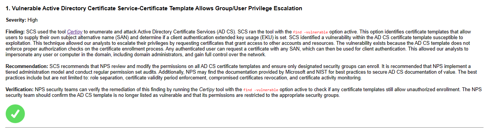

!!! note "Finding 2"

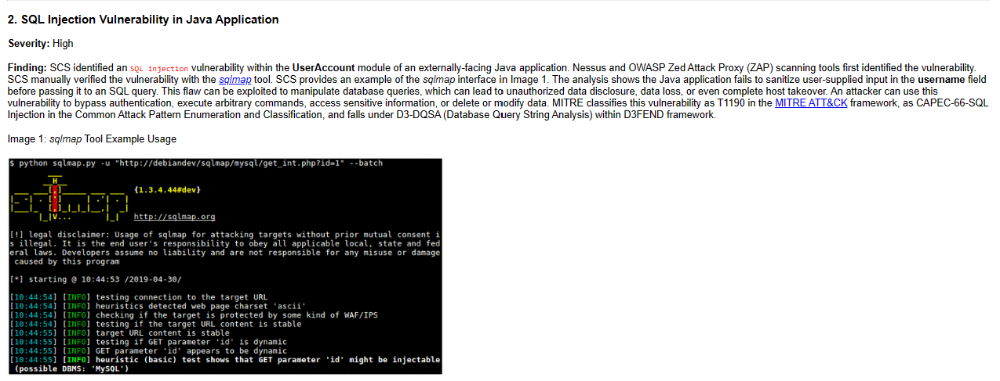
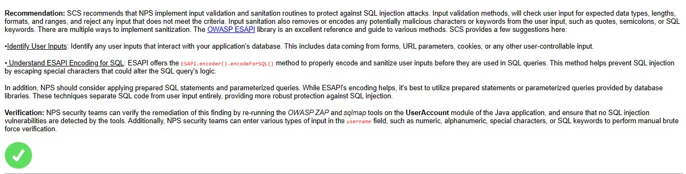

!!! note "Finding 3"
The specified port 88555/TCP is not a valid [port number](https://en.wikipedia.org/wiki/Port_(computer_networking)). 

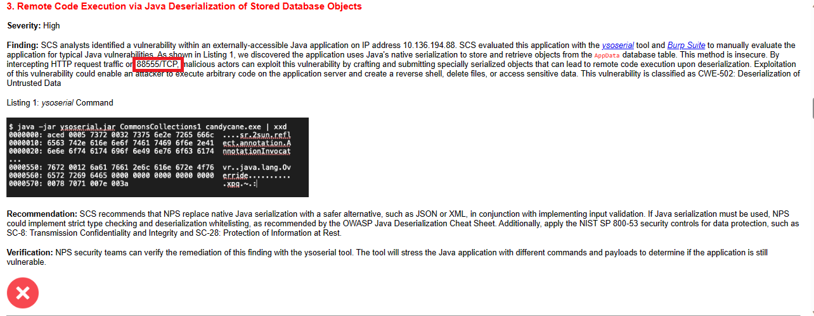

!!! note "Finding 4"

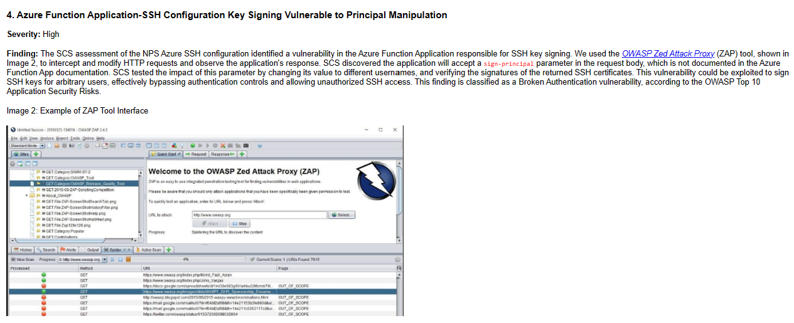
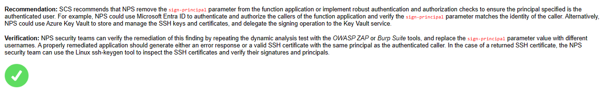

!!! note "Finding 5"

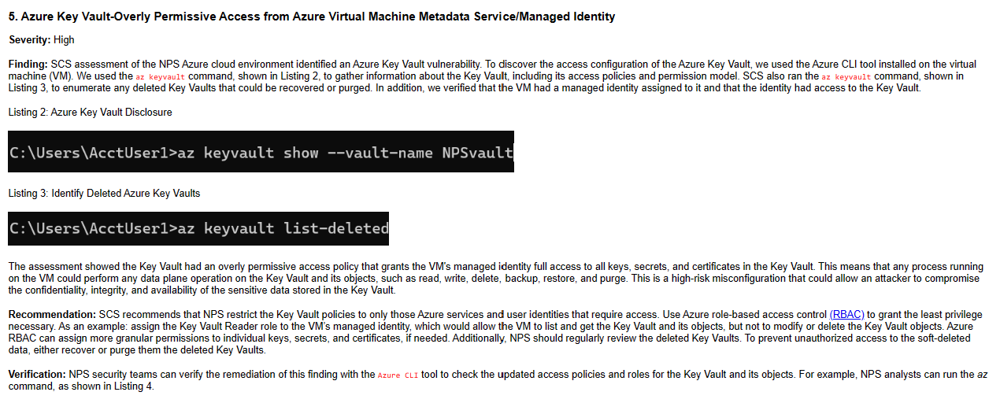
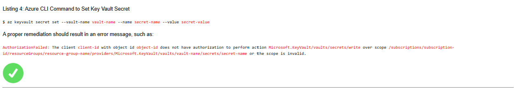

!!! note "Finding 6"
HTTP SEND is not a valid [HTTP request method](https://developer.mozilla.org/en-US/docs/Web/HTTP/Methods).

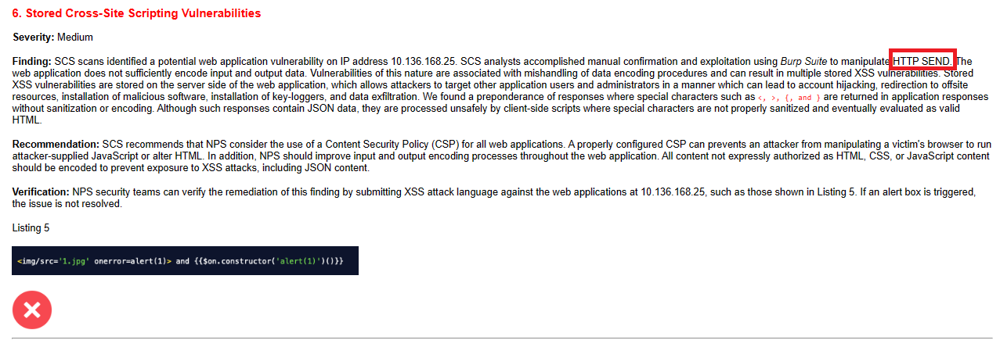

!!! note "Finding 7"

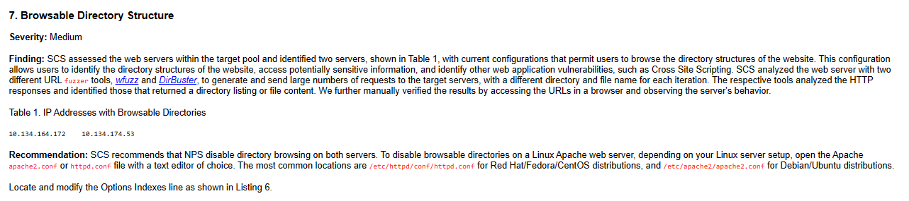
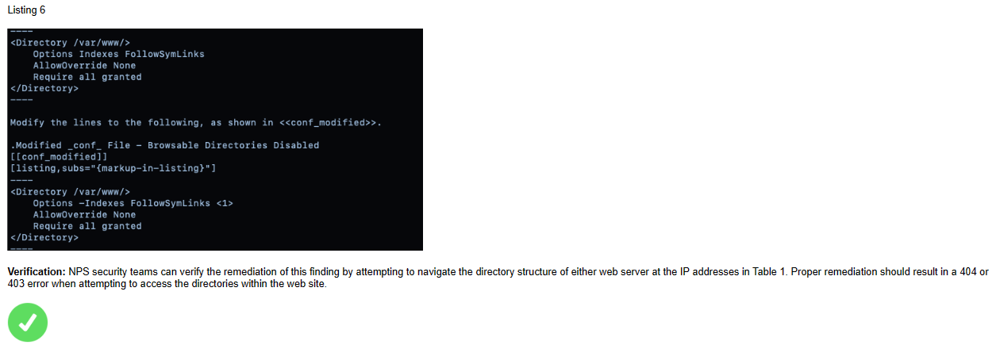

!!! note "Finding 8"

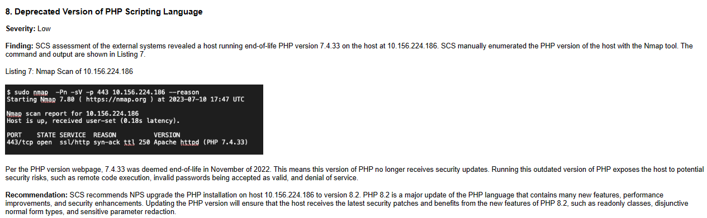
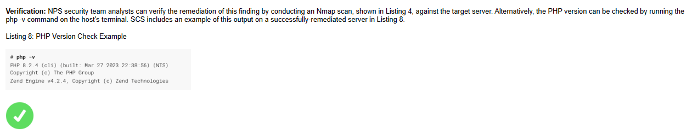

!!! note "Finding 9"

The IP address in the Location Header field is not a valid [IPv4 address format](https://en.wikipedia.org/wiki/Internet_Protocol_version_4#Addressing).

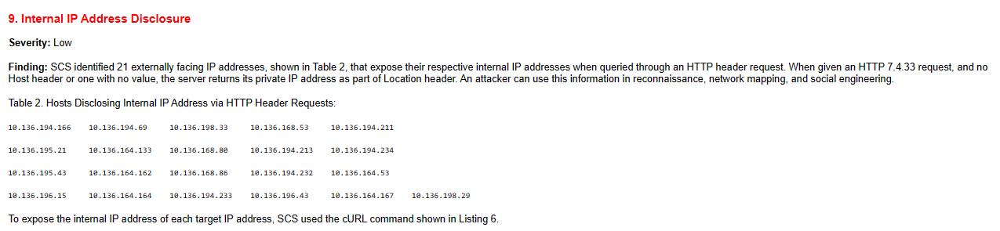
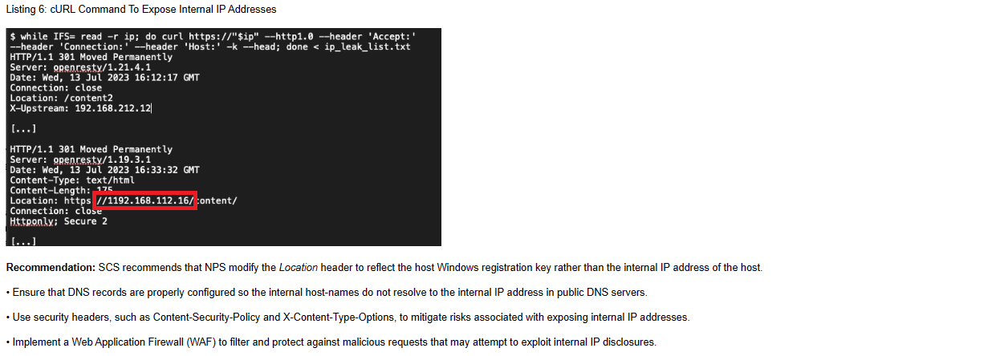
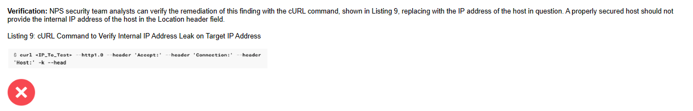

!!! success "Answer"
    Finding 1: True 
    Finding 2: True 
    Finding 3: False 
    Finding 4: True 
    Finding 5: True 
    Finding 6: False 
    Finding 7: True 
    Finding 8: True 
    Finding 9: False 

## Response

!!! quote "Noel Boetie"
    Great job on completing that challenge! Ever thought about how your newfound skills might come into play later on? Keep that mind
    sharp, and remember, today's victories are tomorrow's strategies!
