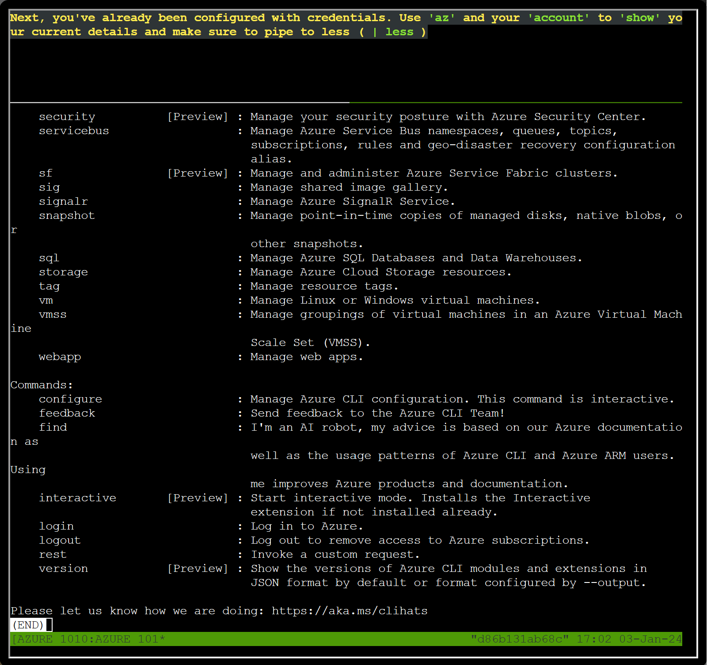

# Azure 101

**Difficulty**: :fontawesome-solid-star::fontawesome-solid-star::fontawesome-regular-star::fontawesome-regular-star::fontawesome-regular-star:<br/>
**Direct link**: --

## Objective

!!! question "Request"
    Help Sparkle Redberry with some Azure command line skills. Find the elf and the terminal on Christmas Island.

??? quote "Sparkle Redberry"
    Hey, Sparkle Redberry here! So, I've been trying to learn about Azure and the Azure CLI and it's driving me nuts.<br/>
    Alabaster Snowball decided to use Azure to host some of his fancy new IT stuff on Geese Islands, and now us elves have to learn it too.<br/>
    Anyway, I know it's important and everyone says it's not as difficult as it seems, but honestly it still feels like quite a challenge for me.<br/>
    Alabaster sent us this [Azure CLI reference](https://learn.microsoft.com/en-us/cli/azure/reference-index?view=azure-cli-latest) as well. It's super handy, he said. Honestly, it just confuses me even more.<br/>
    If you can spare a moment, would you mind giving me a hand with this terminal? I'd be really grateful! Pretty please, with holly leaves on top!<br/>

## Hints

??? tip "Azure CLI Reference"
    *From: Sparkle Redberry*<br/>
    *Terminal: Azure 101*<br/>
    The Azure CLI tools come with a builtin help system, but Microsoft also provides this [handy cheatsheet](https://learn.microsoft.com/en-us/cli/azure/reference-index?view=azure-cli-latest).

## Solution

This challenge steps us through the basics of using Azure CLI. 

!!! question "Task 1"
    You may not know this but the Azure cli help messages are very easy to access. First, try typing:
    $ az help | less

```
elf@471577fbf558:~$ az help | less
```
We can scroll or use the ++down++ key to reach the END of the help menu. To exit out of the Azure CLI help menu or any output that returns using *| less*, press the ++q++ key.



!!! question "Task" 
    Next, you've already been configured with credentials. Use 'az' and your 'account' to 'show' your current details and make sure to pipe to less ( | less )
```
elf@471577fbf558:~$ az account show | less
```
!!! question "Task 3"
    Excellent! Now get a list of resource groups in Azure.<br/>
    For more information:<br/>
    [https://learn.microsoft.com/en-us/cli/azure/group?view=azure-cli-latest](https://learn.microsoft.com/en-us/cli/azure/group?view=azure-cli-latest)

```hl_lines="4 14"
elf@471577fbf558:~$ az group list
[
  {
    "id": "/subscriptions/2b0942f3-9bca-484b-a508-abdae2db5e64/resourceGroups/northpole-rg1",
    "location": "eastus",
    "managedBy": null,
    "name": "northpole-rg1",
    "properties": {
      "provisioningState": "Succeeded"
    },
    "tags": {}
  },
  {
    "id": "/subscriptions/2b0942f3-9bca-484b-a508-abdae2db5e64/resourceGroups/northpole-rg2",
    "location": "westus",
    "managedBy": null,
    "name": "northpole-rg2",
    "properties": {
      "provisioningState": "Succeeded"
    },
    "tags": {}
  }
]
elf@471577fbf558:~$ 
```
!!! question "Task 4"
    Ok, now use one of the resource groups to get a list of function apps. For more information:<br/>
    [https://learn.microsoft.com/en-us/cli/azure/functionapp?view=azure-cli-latest](https://learn.microsoft.com/en-us/cli/azure/functionapp?view=azure-cli-latest)<br/>
    Note: Some of the information returned from this command relates to other cloud assets used by Santa and his elves.

??? tip "This information is used in another challenge"
    [Certificate SSHenanigans](./o15.md)

```
elf@471577fbf558:~$ az functionapp list --resource-group northpole-rg1
[
  {
    "appServicePlanId": "/subscriptions/2b0942f3-9bca-484b-a508-abdae2db5e64/resourceGroups/northpole-rg1/providers/Microsoft.Web/serverfarms/EastUSLinuxDynamicPlan",
    "availabilityState": "Normal",
    "clientAffinityEnabled": false,
    "clientCertEnabled": false,
    "clientCertExclusionPaths": null,
    "clientCertMode": "Required",
    "cloningInfo": null,
    "containerSize": 0,
    "customDomainVerificationId": "201F74B099FA881DB9368A26C8E8B8BB8B9AF75BF450AF717502AC151F59DBEA",
    "dailyMemoryTimeQuota": 0,
    "defaultHostName": "northpole-ssh-certs-fa.azurewebsites.net",
    "enabled": true,
    "enabledHostNames": [
      "northpole-ssh-certs-fa.azurewebsites.net"
    ],
    "extendedLocation": null,
    "hostNameSslStates": [
      {
        "certificateResourceId": null,
        "hostType": "Standard",
        "ipBasedSslResult": null,
        "ipBasedSslState": "NotConfigured",
        "name": "northpole-ssh-certs-fa.azurewebsites.net",
        "sslState": "Disabled",
        "thumbprint": null,
        "toUpdate": null,
        "toUpdateIpBasedSsl": null,
        "virtualIPv6": null,
        "virtualIp": null
      },
      {
        "certificateResourceId": null,
        "hostType": "Repository",
        "ipBasedSslResult": null,
        "ipBasedSslState": "NotConfigured",
        "name": "northpole-ssh-certs-fa.scm.azurewebsites.net",
        "sslState": "Disabled",
        "thumbprint": null,
        "toUpdate": null,
        "toUpdateIpBasedSsl": null,
        "virtualIPv6": null,
        "virtualIp": null
      }
    ],
    "hostNames": [
      "northpole-ssh-certs-fa.azurewebsites.net"
    ],
    "hostNamesDisabled": false,
    "hostingEnvironmentProfile": null,
    "httpsOnly": false,
    "hyperV": false,
    "id": "/subscriptions/2b0942f3-9bca-484b-a508-abdae2db5e64/resourceGroups/northpole-rg1/pro
viders/Microsoft.Web/sites/northpole-ssh-certs-fa",
    "identity": {
      "principalId": "d3be48a8-0702-407c-89af-0319780a2aea",
      "tenantId": "90a38eda-4006-4dd5-924c-6ca55cacc14d",
      "type": "SystemAssigned",
      "userAssignedIdentities": null
    },
    "inProgressOperationId": null,
    "isDefaultContainer": null,
    "isXenon": false,
    "keyVaultReferenceIdentity": "SystemAssigned",
    "kind": "functionapp,linux",
    "lastModifiedTimeUtc": "2023-11-09T14:43:01.183333",
    "location": "East US",
    "maxNumberOfWorkers": null,
    "name": "northpole-ssh-certs-fa",
    "outboundIpAddresses": "",
    "possibleOutboundIpAddresses": "",
    "publicNetworkAccess": null,
    "redundancyMode": "None",
    "repositorySiteName": "northpole-ssh-certs-fa",
    "reserved": true,
    "resourceGroup": "northpole-rg1",
    "scmSiteAlsoStopped": false,
    "siteConfig": {
      "acrUseManagedIdentityCreds": false,
      "acrUserManagedIdentityId": null,
      "alwaysOn": false,
      "antivirusScanEnabled": null,
      "apiDefinition": null,
      "apiManagementConfig": null,
      "appCommandLine": null,
      "appSettings": null,
      "autoHealEnabled": null,
      "autoHealRules": null,
      "autoSwapSlotName": null,
      "azureMonitorLogCategories": null,
      "azureStorageAccounts": null,
      "connectionStrings": null,
      "cors": null,
      "customAppPoolIdentityAdminState": null,
      "customAppPoolIdentityTenantState": null,
      "defaultDocuments": null,
      "detailedErrorLoggingEnabled": null,
      "documentRoot": null,
      "elasticWebAppScaleLimit": null,
      "experiments": null,
      "fileChangeAuditEnabled": null,
      "ftpsState": null,
      "functionAppScaleLimit": 200,
      "functionsRuntimeScaleMonitoringEnabled": null,
      "handlerMappings": null,
      "healthCheckPath": null,
      "http20Enabled": true,
      "http20ProxyFlag": null,
      "httpLoggingEnabled": null,
      "ipSecurityRestrictions": null,
      "ipSecurityRestrictionsDefaultAction": null,
      "javaContainer": null,
      "javaContainerVersion": null,
      "javaVersion": null,
      "keyVaultReferenceIdentity": null,
      "limits": null,
      "linuxFxVersion": "Python|3.11",
      "loadBalancing": null,
      "localMySqlEnabled": null,
      "logsDirectorySizeLimit": null,
      "machineKey": null,
      "managedPipelineMode": null,
      "managedServiceIdentityId": null,
      "metadata": null,
      "minTlsCipherSuite": null,
      "minTlsVersion": null,
      "minimumElasticInstanceCount": 0,
      "netFrameworkVersion": null,
      "nodeVersion": null,
      "numberOfWorkers": 1,
      "phpVersion": null,
      "powerShellVersion": null,
      "preWarmedInstanceCount": null,
      "publicNetworkAccess": null,
      "publishingPassword": null,
      "publishingUsername": null,
      "push": null,
      "pythonVersion": null,
      "remoteDebuggingEnabled": null,
      "remoteDebuggingVersion": null,
      "requestTracingEnabled": null,
      "requestTracingExpirationTime": null,
      "routingRules": null,
      "runtimeADUser": null,
      "runtimeADUserPassword": null,
      "scmIpSecurityRestrictions": null,
      "scmIpSecurityRestrictionsDefaultAction": null,
      "scmIpSecurityRestrictionsUseMain": null,
      "scmMinTlsVersion": null,
      "scmType": null,
      "sitePort": null,
      "sitePrivateLinkHostEnabled": null,
      "storageType": null,
      "supportedTlsCipherSuites": null,
      "tracingOptions": null,
      "use32BitWorkerProcess": null,
      "virtualApplications": null,
      "vnetName": null,
      "vnetPrivatePortsCount": null,
      "vnetRouteAllEnabled": null,
      "webSocketsEnabled": null,
      "websiteTimeZone": null,
      "winAuthAdminState": null,
      "winAuthTenantState": null,
      "windowsConfiguredStacks": null,
      "windowsFxVersion": null,
      "xManagedServiceIdentityId": null
    },
    "slotSwapStatus": null,
    "state": "Running",
    "storageAccountRequired": false,
    "suspendedTill": null,
    "tags": {
      "create-cert-func-url-path": "/api/create-cert?code=candy-cane-twirl",
      "project": "northpole-ssh-certs"
    },
    "targetSwapSlot": null,
    "trafficManagerHostNames": null,
    "type": "Microsoft.Web/sites",
    "usageState": "Normal",
    "virtualNetworkSubnetId": null,
    "vnetContentShareEnabled": false,
    "vnetImagePullEnabled": false,
    "vnetRouteAllEnabled": false
  }
]
(END)
```
!!! question "Task 5"
    Find a way to list the only VM in one of the resource groups you have access to.<br/>
    For more information:<br/>
    [https://learn.microsoft.com/en-us/cli/azure/vm?view=azure-cli-latest](https://learn.microsoft.com/en-us/cli/azure/vm?view=azure-cli-latest)

```hl_lines="8"
elf@471577fbf558:~$ az vm list -g northpole-rg1
The client 'f17559a4-d8a2-4661-ba0f-c04f8cf2926d' with object id '8deacb33-214d-4d94-9ab4-d27768410f17' does not have authorization to perform action 'Microsoft.Compute/virtualMachines/read' over scope '/subscriptions/2b0942f3-9bca-484b-a508-abdae2db5e64/resourceGroups/northpole-rg1/providers/Microsoft.Compute/virtualMachines' or the scope is invalid. If access was recently granted, please refresh your credentials.
elf@471577fbf558:~$ az vm list -g northpole-rg2 | less
[
  {
    "id": "/subscriptions/2b0942f3-9bca-484b-a508-abdae2db5e64/resourceGroups/northpole-rg2/providers/Microsoft.Compute/virtualMachines/NP-VM1",
    "location": "eastus",
    "name": "NP-VM1",
    "properties": {
      "hardwareProfile": {
        "vmSize": "Standard_D2s_v3"
      },
      "provisioningState": "Succeeded",
      "storageProfile": {
        "imageReference": {
          "offer": "UbuntuServer",
          "publisher": "Canonical",
          "sku": "16.04-LTS",
          "version": "latest"
        },
        "osDisk": {
          "caching": "ReadWrite",
          "createOption": "FromImage",
          "managedDisk": {
            "storageAccountType": "Standard_LRS"
          },
          "name": "VM1_OsDisk_1"
        }
      },
      "vmId": "e5f16214-18be-4a31-9ebb-2be3a55cfcf7"
    },
    "resourceGroup": "northpole-rg2",
    "tags": {}
  }
]
(END)
```
!!! question "Task 6"
    Find a way to invoke a run-command against the only Virtual Machine (VM) so you can RunShellScript and get a directory listing to reveal a file on the Azure VM.<br/>
    For more information:<br/>
    [https://learn.microsoft.com/en-us/cli/azure/vm/run-command?view=azure-cli-latest#az-vm-run-command-invoke](https://learn.microsoft.com/en-us/cli/azure/vm/run-command?view=azure-cli-latest#az-vm-run-command-invoke)

We already know the resource group (northpole-rg2), the VM (NP-VM1), and the [command to get a directory listing](../objectives/o3.md) (ls)

``` hl_lines="8"
elf@471577fbf558:~$ az vm run-command invoke -g northpole-rg2 -n NP-VM1 --command-id RunShellScript --scripts "ls -la"
{
  "value": [
    {
      "code": "ComponentStatus/StdOut/succeeded",
      "displayStatus": "Provisioning succeeded",
      "level": "Info",
      "message": "total 52\ndrwxr-x--- 1 0 0 4096 Dec  4 20:38 .\ndrwxr-x--- 1 0 0 4096 Dec  4 20:38 ..\ndrwxr-x--- 1 0 0 4096 Dec  4 20:37 bin\ndrwxr-xr-x 1 0 0 4096 Dec  4 20:38 etc\ndrwxr-x--- 1 0 0 4096 Dec  2 22:16 home\n-rwxr-x--- 1 0 0    0 Dec  4 20:37 jinglebells\ndrwxr-xr-x 1 0 0 4096 Dec  4 20:37 lib\ndrwxr-xr-x 1 0 0 4096 Dec  4 20:37 lib64\ndrwxr-xr-x 1 0 0 4096 Dec  4 20:37 usr\n",
      "time": 1704303815
    },
    {
      "code": "ComponentStatus/StdErr/succeeded",
      "displayStatus": "Provisioning succeeded",
      "level": "Info",
      "message": "",
      "time": 1704303815
    }
  ]
}
```

!!! success "Answer"
    Great, you did it all!

## Response

!!! quote "Sparkle Redberry"
    Wow, you did it!<br/>
    It makes quite a bit more sense to me now. Thank you so much!<br/>
    That Azure Function App [URL](https://northpole-ssh-certs-fa.azurewebsites.net/api/create-cert?code=candy-cane-twirl) you came across in the terminal looked interesting.<br/>
    It might be part of that new project Alabaster has been working on with the help of ChatNPT.<br/>
    Let me tell you, since he started using ChatNPT he's been introducing a lot of amazing innovation across the islands.<br/>
    Knowing Alabaster, he'll be delighted to tell you all about it! I think I last saw him on Pixel island.<br/>
    By the way, as part of the Azure documentation he sent the elves, Alabaster also noted that if Azure CLI tools aren't available in an Azure VM we should use the [Azure REST API](https://learn.microsoft.com/en-us/entra/identity/managed-identities-azure-resources/how-to-use-vm-token) instead.<br/>
    I'm not really sure what that means, but I guess I know what I'll be studying up on next.<br/>
