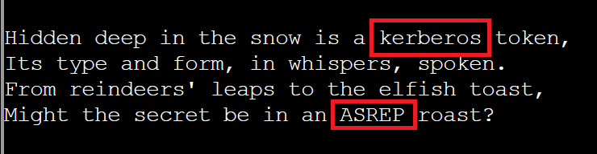
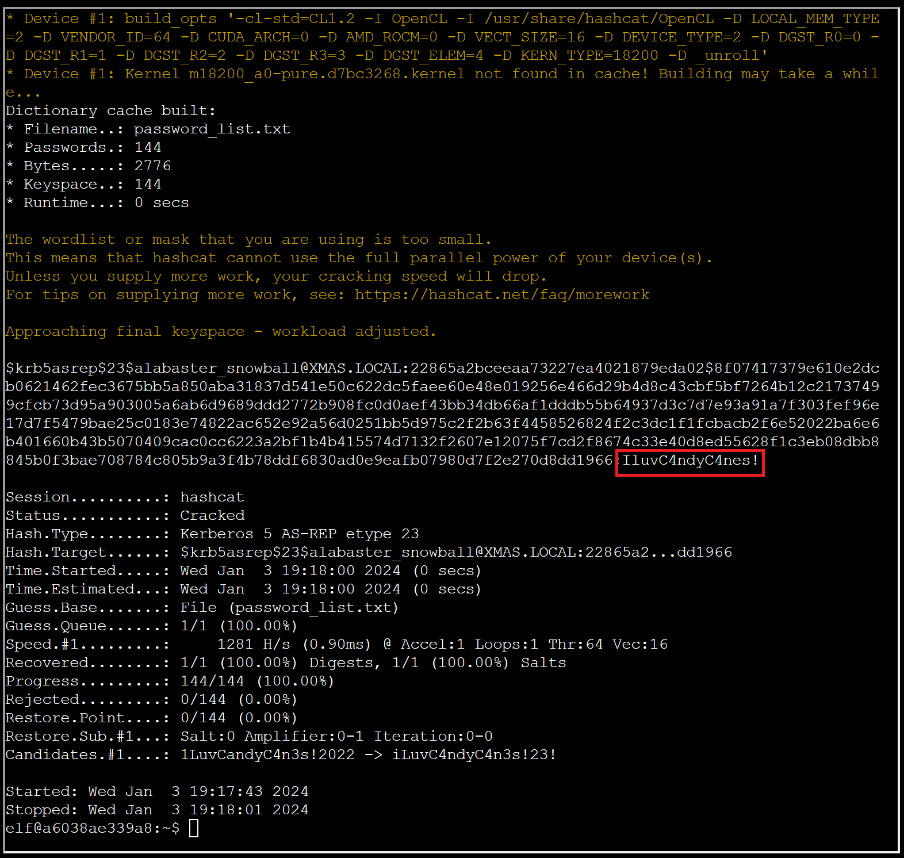

# Hashcat

**Difficulty**: :fontawesome-solid-star::fontawesome-solid-star::fontawesome-solid-star::fontawesome-regular-star::fontawesome-regular-star:<br/>
**Direct link**: --

## Objective

!!! question "Request"
    Eve Snowshoes is trying to recover a password. Head to the Island of Misfit Toys and take a crack at it!

??? quote "Eve Snowshoes"
    Greetings, fellow adventurer!<br/>Welcome to Scaredy-Kite Heights, the trailhead of the trek through the mountains on the way to the wonderful Squarewheel Yard!<br/><br/>
    I'm Eve Snowshoes, resident tech hobbyist, and I hear Alabaster is in quite the predicament.<br/>Our dear Alabaster forgot his password. He's been racking his jingle bells of memory with no luck.<br/>I've been trying to handle this password recovery thing parallel to this hashcat business myself but it seems like I am missing some tricks.<br/>So, what do you say, chief, ready to get your hands on some hashcat action and help a distraught elf out?


## Solution

Clicking on the Cranberry Pi terminal icon presents us with a poem that contains clues to solving this challenge.

??? quote "Clicking on the Cranberry Pi terminal icon presents us with a poem that contains clues to solving this challenge."
    In a realm of bytes and digital cheer,  
    The festive season brings a challenge near.  
    Santa's code has twists that may enthrall,  
    It's up to you to decode them all.

    Hidden deep in the snow is a kerberos token,  
    Its type and form, in whispers, spoken.  
    From reindeers' leaps to the elfish toast,  
    Might the secret be in an ASREP roast?

    `hashcat`, your reindeer, so spry and true,  
    Will leap through hashes, bringing answers to you.  
    But heed this advice to temper your pace,  
    `-w 1 -u 1 --kernel-accel 1 --kernel-loops 1`, just in case.

    For within this quest, speed isn't the key,  
    Patience and thought will set the answers free.  
    So include these flags, let your command be slow,  
    And watch as the right solutions begin to show.

    For hints on the hash, when you feel quite adrift,  
    This festive link, your spirits, will lift:  
    [https://hashcat.net/wiki/doku.php?id=example_hashes](https://hashcat.net/wiki/doku.php?id=example_hashes)

    And when in doubt of `hashcat`'s might,  
    The CLI docs will guide you right:  
    [https://hashcat.net/wiki/doku.php?id=hashcat](https://hashcat.net/wiki/doku.php?id=hashcat)

    Once you've cracked it, with joy and glee so raw,  
    Run /bin/runtoanswer, without a flaw.  
    Submit the password for Alabaster Snowball,  
    Only then can you claim the prize, the best of all.

    So light up your terminal, with commands so grand,  
    Crack the code, with `hashcat` in hand!  
    Merry Cracking to each, by the pixelated moon's light,  
    May your hashes be merry, and your codes so right!

    * Determine the hash type in hash.txt and perform a wordlist cracking attempt to find which password is correct and submit it to    /bin/runtoanswer .*

Listing our directory contents we see that we have access to the HELP (which contains the poem), hash.txt, and password_list.txt files.

```
elf@f9961835c47e:~$ ls
HELP  hash.txt  password_list.txt
elf@f9961835c47e:~$ cat hash.txt 
$krb5asrep$23$alabaster_snowball@XMAS.LOCAL:22865a2bceeaa73227ea4021879eda02$8f07417379e610e2dcb0621462fec3675bb5a850aba31837d541e50c622dc5faee60e48e019256e466d29b4d8c43cbf5bf7264b12c21737499cfcb73d95a903005a6ab6d9689ddd2772b908fc0d0aef43bb34db66af1dddb55b64937d3c7d7e93a91a7f303fef96e17d7f5479bae25c0183e74822ac652e92a56d0251bb5d975c2f2b63f4458526824f2c3dc1f1fcbacb2f6e52022ba6e6b401660b43b5070409cac0cc6223a2bf1b4b415574d7132f2607e12075f7cd2f8674c33e40d8ed55628f1c3eb08dbb8845b0f3bae708784c805b9a3f4b78ddf6830ad0e9eafb07980d7f2e270d8dd1966elf@f9961835c47e:~$ 
```

In order to run hashcat successfully, we want to know what hash type we are dealing with. The HELP poem included some hints:



Looking at the [example hashes](https://hashcat.net/wiki/doku.php?id=example_hashes), we find hash 18200 'Kerberos 5, etype 23, AS-REP'. Examining the hash file we can also see the beginning of the hash `$krb5asrep` and the format look to match the example of hash 18200.

Next, let's run hashcat using this information within the provided password list file. 

??? warning "Performance Options"
    Remember to use the recommended flags for performance that were mentioned in the poem `-w 1 -u 1 --kernel-accel 1 --kernel-loops 1`.

```
elf@f9961835c47e:~$ hashcat -m 18200 -w 1 -u 1 --kernel-accel 1 --kernel-loops 1 --force hash.txt password_list.txt
hashcat (v5.1.0) starting...

OpenCL Platform #1: The pocl project
====================================
* Device #1: pthread-Intel(R) Xeon(R) CPU @ 2.80GHz, 8192/30063 MB allocatable, 8MCU

Hashes: 1 digests; 1 unique digests, 1 unique salts
Bitmaps: 16 bits, 65536 entries, 0x0000ffff mask, 262144 bytes, 5/13 rotates
Rules: 1

Applicable optimizers:
* Zero-Byte
* Not-Iterated
* Single-Hash
* Single-Salt

Minimum password length supported by kernel: 0
Maximum password length supported by kernel: 256

ATTENTION! Pure (unoptimized) OpenCL kernels selected.
This enables cracking passwords and salts > length 32 but for the price of drastically reduced performance.
If you want to switch to optimized OpenCL kernels, append -O to your commandline.

Watchdog: Hardware monitoring interface not found on your system.
Watchdog: Temperature abort trigger disabled.

* Device #1: build_opts '-cl-std=CL1.2 -I OpenCL -I /usr/share/hashcat/OpenCL -D LOCAL_MEM_TYPE=2 -D VENDOR_ID=64 -D CUDA_ARCH=0 -D AMD_ROCM=0 -D VECT_SIZE=16 -D DEVICE_TYPE=2 -D DGST_R0=0 -D DGST_R1=1 -D DGST_R2=2 -D DGST_R3=3 -D DGST_ELEM=4 -D KERN_TYPE=18200 -D _unroll'
* Device #1: Kernel m18200_a0-pure.d7bc3268.kernel not found in cache! Building may take a while...
Dictionary cache built:
* Filename..: password_list.txt
* Passwords.: 144
* Bytes.....: 2776
* Keyspace..: 144
* Runtime...: 0 secs

The wordlist or mask that you are using is too small.
This means that hashcat cannot use the full parallel power of your device(s).
Unless you supply more work, your cracking speed will drop.
For tips on supplying more work, see: https://hashcat.net/faq/morework

Approaching final keyspace - workload adjusted.  

$krb5asrep$23$alabaster_snowball@XMAS.LOCAL:22865a2bceeaa73227ea4021879eda02$8f07417379e610e2dcb0621462fec3675bb5a850aba31837d541e50c622dc5faee60e48e019256e466d29b4d8c43cbf5bf7264b12c21737499cfcb73d95a903005a6ab6d9689ddd2772b908fc0d0aef43bb34db66af1dddb55b64937d3c7d7e93a91a7f303fef96e17d7f5479bae25c0183e74822ac652e92a56d0251bb5d975c2f2b63f4458526824f2c3dc1f1fcbacb2f6e52022ba6e6b401660b43b5070409cac0cc6223a2bf1b4b415574d7132f2607e12075f7cd2f8674c33e40d8ed55628f1c3eb08dbb8845b0f3bae708784c805b9a3f4b78ddf6830ad0e9eafb07980d7f2e270d8dd1966:IluvC4ndyC4nes!
                                                 
Session..........: hashcat
Status...........: Cracked
Hash.Type........: Kerberos 5 AS-REP etype 23
Hash.Target......: $krb5asrep$23$alabaster_snowball@XMAS.LOCAL:22865a2...dd1966
Time.Started.....: Wed Jan  3 18:30:26 2024 (0 secs)
Time.Estimated...: Wed Jan  3 18:30:26 2024 (0 secs)
Guess.Base.......: File (password_list.txt)
Guess.Queue......: 1/1 (100.00%)
Speed.#1.........:     1252 H/s (0.81ms) @ Accel:1 Loops:1 Thr:64 Vec:16
Recovered........: 1/1 (100.00%) Digests, 1/1 (100.00%) Salts
Progress.........: 144/144 (100.00%)
Rejected.........: 0/144 (0.00%)
Restore.Point....: 0/144 (0.00%)
Restore.Sub.#1...: Salt:0 Amplifier:0-1 Iteration:0-0
Candidates.#1....: 1LuvCandyC4n3s!2022 -> iLuvC4ndyC4n3s!23!

Started: Wed Jan  3 18:30:10 2024
Stopped: Wed Jan  3 18:30:28 2024
elf@f9961835c47e:~$ 
```
We can see the cracked password in the output.



The last step is to run `/bin/runtoanswer` and input our password.


!!! success "Answer"
    IluvC4ndyC4nes!

## Response

!!! quote "Eve Snowshoes"
    Aha! Success! Alabaster will undoubtedly be grateful for our assistance.<br/>
    Onward to our next adventure, comrade! Feel free to explore this whimsical world of gears and steam!
