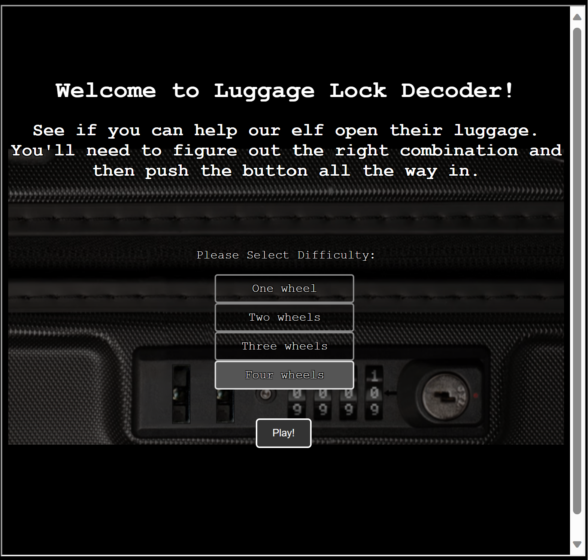
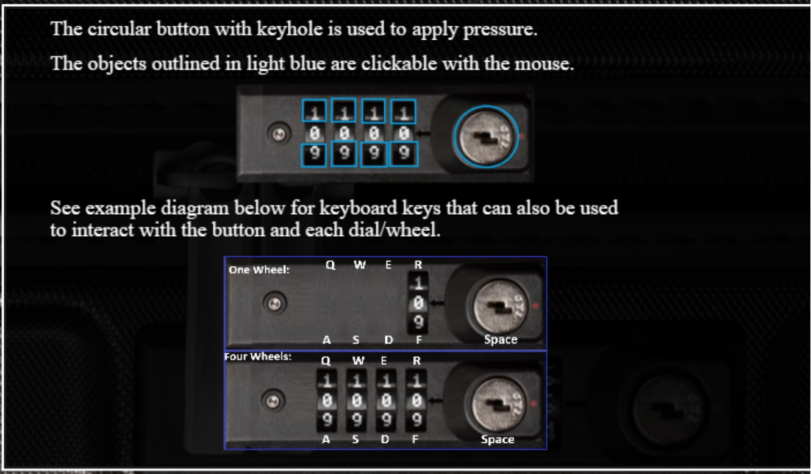
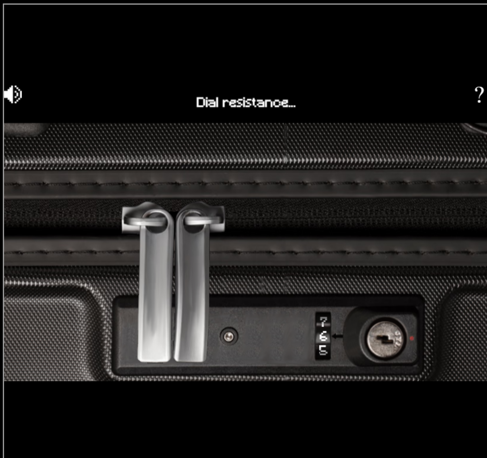
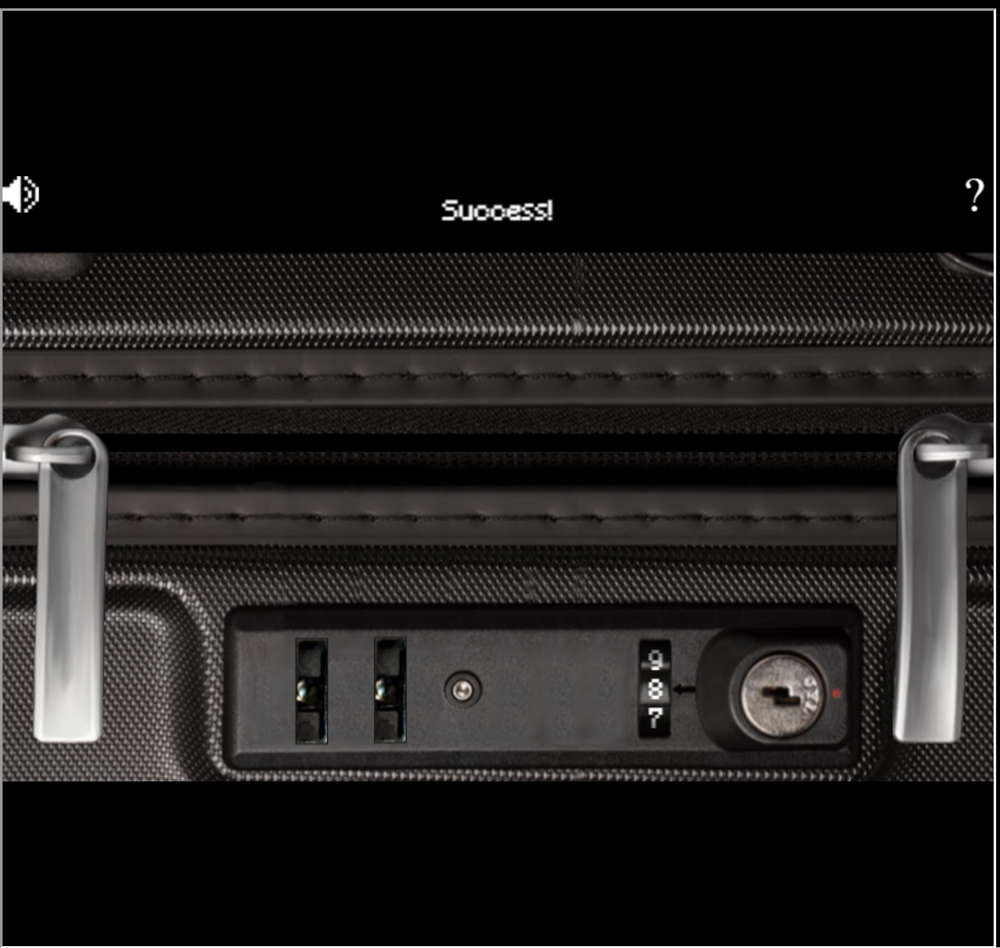
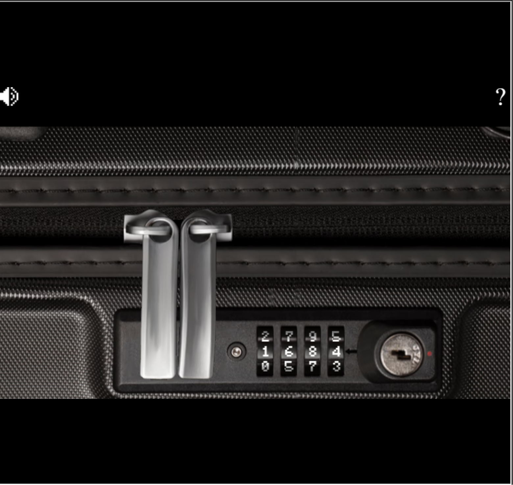
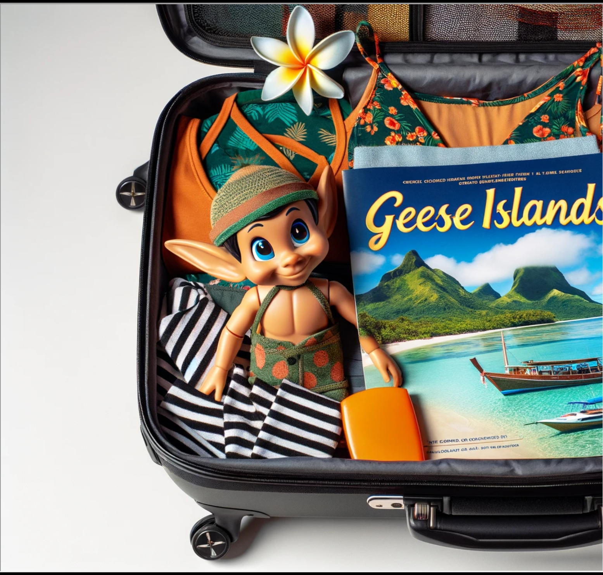

# Luggage Lock

**Difficulty**: :fontawesome-solid-star::fontawesome-regular-star::fontawesome-regular-star::fontawesome-regular-star::fontawesome-regular-star: 
**Direct link**: --

## Objective

!!! question "Request"
    Help Garland Candlesticks on the Island of Misfit Toys get back into his luggage by finding the correct position for all four dials

??? quote "Garland Candlesticks"
    Hey there, I'm Garland Candlesticks! I could really use your help with something. 
    You see, I have this important pamphlet in my luggage, but I just can't remember the combination to open it! 
    Chris Elgee gave a talk recently that might help me with this problem. Did you attend that? 
    I seem to recall Chris mentioning a technique to figure out the combinations... 
    I have faith in you! We'll get that luggage open in no time. 
    This pamphlet is crucial for me, so I can't thank you enough for your assistance. 
    Once we retrieve it, I promise to treat you to a frosty snack on me! 

## Hints

??? tip "Lock Talk"
    *From: Garland Candlesticks* 
    *Terminal: Luggage Lock Decode* 
    Check out Chris Elgee's [talk](https://www.youtube.com/watch?v=ycM1hBSEyog) regarding his and his wife's luggage. Sounds weird but interesting!

## Solution

Our hint to solving this challenge is the [Lock Talk](https://www.youtube.com/watch?v=ycM1hBSEyog) given by Chris Elgee mentioned by Garland Candlesticks in his introduction. After watching this talk, we have a good idea of how to approach this puzzle. The challenge allows some practice with one, two, three, or four wheels. Completing the objective requires solving the puzzle using all four wheels.

| | |
|---|---|
|  | |

Put gentle pressure on the open lock button (by clicking or pressing space a couple times) and turn the dial (by clicking or using the keyboard shortcuts shown in the instructions) until you see the 'Dial resistance...' dialog pop up.

Press the lock button again when you believe you have found the number showing the most resistence and the lock will open if it is correct.

Repeat for using all four wheels until the luggage opens to reveal Garland's important Geese Islands travel pamphlet.

!!! success "Answer"
    Successfully open the luggage.

## Response

!!! quote "Garland Candlesticks"
    Wow, you did it! I knew you could crack the code. Thank you so much!
